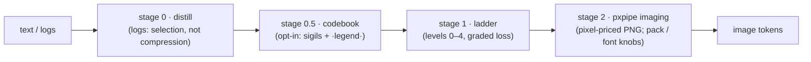

# tanuki-context — design notes

What this project is, why each piece exists, and the logic behind it.
Companion to [README.md](README.md) (usage) — this is the *why*.

> **Branch note** — these notes were written for the Rust implementation (now
> on the [`rust` branch](../../tree/rust)); file names reference `src/*.rs`.
> The `main` branch is a 1:1 TypeScript port (same modules, `src/*.ts`,
> byte/pixel-identical output — see `reference/parity-ts.mjs`), so every
> design decision below applies unchanged.

## 1. Origin

[pxpipe](https://github.com/teamchong/pxpipe) exploits one pricing fact: an
image's token cost is fixed by its **pixel dimensions**, not by how much text
is inside it. Dense text rendered as a PNG costs a fraction of the same text
sent as tokens (~3+ chars per image-token vs ~1 char per text-token on real
traffic). pxpipe ships that as a transparent Anthropic proxy.

We first ran it as that proxy. It worked (measured 76.5% input-token cut on
real traffic), but the proxy relocates the system prompt into a user-turn
block labelled `<system-reminder> … not written by the user` — which reads
exactly like a prompt injection. A security-conscious agent flagged it and
refused its own configuration. That failure mode is structural, not a bug:
a transparent rewriting proxy *is* indistinguishable from an attacker to the
model it serves.

So the design moved from **implicit** (proxy rewrites everything) to
**explicit** (the model calls a tool when it wants the cut). First as a node
MCP wrapping pxpipe's library, then — this repo — as a single-binary Rust
rewrite. The imaging stage keeps the `pxpipe` name: the mechanic is theirs.

## 2. The pipeline

Three stages, strictly ordered, each optional. The order is the point:
**image tokens are priced by pixels, and pixels are proportional to
characters** — so every character removed by an earlier stage multiplies
through the later ones. Distill −55% then imaging −78% compounds to −90%,
not −78%.

### Stage 0 — distill (for logs and command output)

Borrowed logic from [context-mode](https://github.com/mksglu/context-mode):
don't *compress* noise, **drop** it — but deterministically, with exact
accounting, and no model in the loop. Three passes:

1. **Consecutive block collapse.** Logs repeat in cycles (`opened / closed /
   COMMAND=…`), not just single lines. After masking volatile tokens
   (timestamps, uuids, hex runs, numbers+units → `<ts> <uuid> <hex> <n>`),
   repetitions of 1–8-line blocks collapse to the first block +
   `[×N similar]`. Chronology preserved.
2. **Global near-dupe suppression.** Interleaved noise defeats pass 1 (a
   3-line cycle where one line varies — real `sudo` logs do exactly this).
   Two tiers: an **exact** masked key, then a **coarse template** key
   (non-alpha tokens → `<v>`, so 1.6M distinct file paths in an rclone log
   unify into one `Copied (new)` template). First 2–3 occurrences of each
   key stay in place; the rest are dropped and reported in a trailing
   summary with exact counts (`×375,347 …Copied (new)…`).
3. **Query slice** (optional). A regex keeps matching lines ± context with
   `… N lines omitted` markers — search-instead-of-read.

**Hard invariant:** any line matching the important pattern
(err/error/exception incl. CamelCase `TypeError`, warn, fail, panic, fatal,
traceback, denied, refused, timeout, assert, segfault — plural/suffix forms
included) is *never* collapsed, suppressed, or reworded. On a real journal:
0 important lines lost, verified by set-difference against the input.

Why selection beats compression here: a 126 MB rclone log is ~99% the same
three events. Imaging it raw still pays for every repeat (−78%); distilling
first removes the repeats *before* they reach the renderer (−99.2%), while
the summary table keeps every distinct event type visible with its true
frequency. Information density goes up, not down.

### Stage 1 — ladder (graded, caller-chosen loss)

Text-level compression as an explicit loss dial, each level a superset of
the previous:

| level | name | loss | what it does |
|---|---|---|---|
| 0 | none | none | passthrough |
| 1 | whitespace | lossless | trailing whitespace, blank-run collapse — safe for code |
| 2 | prose | light | collapse spaces, cut filler phrases ("in order to"→"to") |
| 3 | dense | medium | drop articles and intensifiers |
| 4 | caveman | heavy | telegraphic: drop function words — gist only |

**Exact-recall guard (from level 2 up):** a line is passed **verbatim** if it
is indented (code), symbol-dense (>30% non-prose characters — JSON, log
lines), or contains any whitespace-free token ≥24 chars (hashes, paths,
URLs, ids). Loss only ever touches prose. This is why L1–L4 measure ~0% on
source code: that's correctness, not weakness — the guard refusing to
reword what must survive byte-exact.

The lossy levels are the safe subset of "Caveman"/token-optimizer-style
prompt compression. We evaluated and rejected model-based token pruning
(LLMLingua/RTK): it deletes tokens it judges unimportant, which is exactly
the silent-confabulation risk pxpipe's own findings warn about. A
deterministic, inspectable ladder with a protected-line guard gives the
same win on prose without gambling exact strings.

### Stage 2 — pxpipe imaging

A faithful port of pxpipe's production dense renderer:

- **reflow**: strip trailing whitespace, collapse blank runs, expand tabs to
  4-col stops (`→` marker), then join hard newlines with the `↵` sentinel so
  short lines *pack* into full-width rows instead of wasting a row each.
  Lossless at the transform level — `↵` marks every original newline, so the
  text is reconstructable. Pre-existing `↵` in the source is swapped to `⏎`
  first so the sentinel can't collide.
- **wrap** at 312 columns, by codepoint; wide (CJK) glyphs take 2 cells.
- **page**: ≤90 rows / 28,080 chars per page → 1568×728 px max (Anthropic's
  no-resample bound; 56×26 = 1,456 tokens/page under the 28-px patch grid).
- **blit**: 5×8 anti-aliased glyph cells (max-blend coverage), invert to
  black-on-white, grayscale PNG.

Glyphs are not re-rasterized: they are **extracted from pxpipe's own
generated atlas** (`tools/gen-glyphs.mjs`), so pages are pixel-faithful to
the reference — which is what makes token parity *exact* rather than
approximate. On top of pxpipe's BMP coverage (Spleen 5×8 + Unifont) we add
the **astral planes** from GNU `unifont_upper` (16×16/8×16 1-bit bitmaps
box-filtered to the same 10×8/5×8 AA cells), so emoji and plane-1+ symbols
render instead of dropping — the one place tanuki deliberately exceeds the
reference. Unassigned codepoints become readable `[U+HEX]` escapes (pxpipe
v0.11 semantics); invisible formatting codepoints (zero-width, variation
selectors, combining marks) blit as blank cells. Nothing drops silently.

**pxpipe v0.11 sync** (adopted upstream changes, 2026-07): image tokens are
billed by Anthropic's documented **28×28-px patch grid** — `Σ ⌈w/28⌉×⌈h/28⌉`
per page — replacing the older `pixels/750` fit (a ~4–5% continuous
approximation of the same 784 px²/patch grid; pages never exceed the standard
tier's 1568-px/1568-token limits, so the pre-billing downscale never fires).
The atlas carries upstream's **glyph surgery**: Spleen 5×8 `K` repainted
diagonal-legged (was Hamming-1 from `H`, the atlas's worst confusable; now
Hamming-8 — upstream's paired A/B cut K→H confusions 42→1). And missing
glyphs escape as `[U+HEX]` per upstream #96. The frozen `rust` branch keeps
the px/750 model, so the parity harness compares everything EXCEPT
token-derived fields (`imageTokens`, `totalSavedPct`, `verdict`), which are
normalized out; geometry, chars, pages, and pixels still match byte-exact.

### Stage 2 extensions (tanuki-only, parity-safe)

Three knobs push density past the faithful port. They are off the parity path
by construction: `pack=false, font=Normal, codebook=false` renders
byte-identical to pxpipe (25/25 parity rows still pass), so the wins are
strictly additive. All numbers below are measured via the binary's `estimate`
and reproduced by `reference/methods-report.mjs`.

- **pack** (default on) — a tighter, still-lossless reflow. Tabs collapse to a
  single `→` cell instead of padding to a 4-col stop; a leading-space run of N
  becomes `⇥` + one count symbol (`⇥N`) instead of N cells; and each page is
  **width-trimmed** to its widest actual row instead of always paying for a
  1568-px-wide row. Reconstruction stays byte-exact (`↵`=newline, `→`=tab,
  `⇥N`=indent); pre-existing `→`/`⇥` are swapped to literal stand-ins first,
  exactly as reflow already does for `↵`. A round-trip unit test proves it.
  Measured: **−5% image-tokens on source code, −0% on prose** — prose has no
  indent runs to pack, width-trim only helps pages no row fills, and the
  28-px patch grid quantizes away part of the old px-exact trim win.

- **codebook** (opt-in) — the direct, legitimate inversion of the base64
  "models negotiate an encoding in-context" finding: not obscurity but a
  private high-density notation *for cost*, kept documented. Between distill and
  ladder, recurring long tokens and path prefixes (≥12 chars, ≥3×, net-positive
  only) are replaced by single-cell sigils defined once in a trailing `·legend·`
  line. Because every atlas codepoint costs one flat cell, a 60-char path prefix
  seen 30× collapses to 30 cells + one legend entry. Measured: **−40% on a
  path-heavy log**, **−10% on code** (repo paths and long identifiers repeat
  enough to clear the legend cost), ~0 on plain prose.
  Validated for the oversight property the paper actually worries about:
  a vision model read the `·legend·` line and reconstructed the first log line
  **byte-exact** — model-readable and inspectable, not a covert channel.

- **tiny 4×6 font** (opt-in, experimental) — the "the tokenizer itself" lever.
  The same atlas glyphs are box-filtered from the 5×8 cell into a 4×6 one
  (390 cols × 120 rows/page vs 312 × 90), so the same text needs fewer pixels.
  Measured: **−40–43% image-tokens** across every sample kind. The cost is the
  density↔accuracy frontier the report names: at 4-px width a vision read-back
  scored **99.7% char-accuracy** with a single `M`→`H` glyph confusion. So it
  ships opt-in and gated — fine for logs and bulk prose; verify before trusting
  it with `M_`/`H_`-sensitive identifiers.

Stacked (`pack + codebook + tiny`) the log class reaches **−65%** below the
pxpipe baseline, source code **−43%**, prose **−40%** (28-px patch model).

Two further properties:

- **append-stable pages.** Reflow is deterministic left-to-right, so appending
  content leaves every earlier page byte-identical (verified by hashing). That
  lets prompt-caching price the unchanged pages at cache rates across turns —
  the biggest lever in the base64 report, stacked on the imaging cut.
- **still rejected: model-based pruning.** LLMLingua/RTK stays out for the same
  reason as before — it deletes tokens it *judges* unimportant, the
  silent-confabulation risk. pack and codebook are deterministic and
  reversible; that line holds.

### Implicit mode — the middlebox, readmitted with rules

Section 1 explains why we left the proxy model: pxpipe relocates the system
prompt into a user-turn wrapper that reads like an injection, and an agent
refused it. That verdict was about the *relocation*, not about middleboxes as
such. `tanuki-context proxy` brings the deployment shape back (point
`ANTHROPIC_BASE_URL` at it, zero client changes) under five rules that keep
the rewrite recognizable and consensual in spirit:

1. system prompt and tool definitions are never touched;
2. nothing moves between roles or positions — an oversized text block becomes
   an overt `[tanuki-context: …]` marker plus PNG pages *in the same slot*
   (Anthropic allows image blocks in user content and inside tool_results);
3. the latest message is never imaged (the model may need to quote it);
4. `cache_control` blocks are never touched (rewriting defeats their cache);
5. imaging happens only when `estimate` wins by a margin (default ≥25% and
   ≥300 tokens); everything else forwards byte-for-byte.

Responses stream through untouched; usage is scraped from the stream and the
savings row appended to the same events log `tanuki_stats` reads, with the
baseline defined as actual billed tokens plus the estimated text cost of the
imaged blocks. Explicit MCP mode remains the default and the recommendation;
the proxy exists for clients you can't modify. Wire behaviour is covered by
`test/proxy.test.ts` (transform rules unit-tested, plus a live
proxy-to-mock-upstream session asserting passthrough and the events row).

## 3. Why Rust (measured, not vibes)

The MCP is stdio: clients spawn it per session, so **startup latency and
resident memory are the product**, not just throughput. Options were
benchmarked on this machine's real workload (126 MB log distill) before
rewriting: node 4.20 s, bun 3.48 s, rust 2.44 s (2.31 s final). Go was ruled
out on regex-engine throughput; Zig/C on ecosystem risk for zero additional
win over Rust.

| metric | node reference | tanuki (rust) |
|---|---:|---:|
| distill 126 MB log | 4.21 s | **2.31 s** |
| full pipeline per level | 85 ms – 3.05 s | 59 ms – 1.97 s (**1.4–1.7×**) |
| MCP first response | ~150 ms | **~3–16 ms** |
| server RSS | 177 MB | **3 MB** |
| deployable | node + node_modules | **one ~3.3 MB static binary** |

Two implementation choices keep it light:

- **No async runtime, no MCP SDK.** Stdio MCP is newline-delimited JSON-RPC
  with four methods (`initialize`, `tools/list`, `tools/call`, `ping`) — a
  blocking read loop and `serde_json` cover it in ~80 lines. tokio would buy
  nothing for a serial stdio protocol and cost megabytes.
- **Lazy atlas.** Codepoints + wide flags load eagerly (~180 KB, needed for
  wrap math); the 6.8 MB of AA coverage stays zlib-packed (0.88 MB) inside
  the binary and inflates only on the first actual blit. `tanuki_estimate`
  computes exact page geometry without ever touching pixel data.

Honest reading: the pipeline speedup is 1.4–1.7×, not 10× — PNG deflate
dominates and both zlib implementations are good. The decisive wins are
startup (~10×), memory (~60×), and deployment (one binary).

## 4. Parity as a discipline

The node implementation didn't get deleted — it moved to
`reference/node-mcp/` and became the test oracle. Two harnesses:

- `reference/parity.mjs` — same input through both engines; asserts distill
  counts (runs, exact-tier, template-tier, important-kept) and render
  geometry (pages, image tokens).
- `reference/benchmark.mjs` — the full timed matrix (every level × every
  sample, both engines in-process, median of 3 with discarded warmup) →
  `benchmark-report.html`. Parity is asserted per row: **25/25 pass**.

Getting to *identical* (not "close") surfaced three real porting lessons:

1. **Regex class semantics.** JS `\d`/`\w`/`\b` are ASCII; the Rust `regex`
   crate defaults to Unicode-aware classes (and is much slower for them).
   Porting to explicit ASCII classes + `(?-u:\b)` fixed both a correctness
   drift *and* a 2.6× slowdown at once.
2. **`split(/\s+/)` emits empty edge tokens.** An indented line splits to
   `["", "at", …]` in JS — that leading `""` becomes `<v>` in the coarse
   template key. Rust's `split_whitespace()` doesn't do that, so indented
   and unindented twins grouped differently: a 3-line count drift on 1.6M
   lines. Replicating JS's exact split semantics made the 126 MB template
   tier byte-identical (560,779 = 560,779).
3. **Geometry is data, not code.** Extracting the atlas instead of
   re-rasterizing the fonts is what made render parity trivially exact —
   same coverage bytes in, same pixels out, same pixels/750 out.

## 5. Fidelity model (what can be trusted when)

| path | guarantee |
|---|---|
| imaging (any level 0/1) | source byte-exact reconstructable (`↵` = newline, `→` = tab, `⏎` = literal ↵) |
| imaging + pack | still byte-exact: adds `⇥N` = indent run to the `↵`/`→`/`⏎` sentinels; pre-existing markers escaped first; a unit test round-trips it |
| distill | error/warn/exception lines verbatim; drops are counted with exact ×N; full log stays on disk |
| ladder L2–L4 | code / indented / symbol-dense / long-token lines verbatim; loss confined to prose |
| ladder L4 | prose is gist-only — never use where verbatim prose matters |
| codebook | reversible: every sigil is defined in the trailing `·legend·` line; validated byte-exact by a vision read-back |
| tiny 4×6 font | legible but lossy at the glyph level (99.7% char-accuracy measured; `M`/`H` confusable) — opt-in, verify before trusting exact identifiers |
| stats | savings counted against *all* billed input (input + cache reads + cache creates) — ignoring cache reads would fake the number |

That last row is a story of its own: the first stats implementation read
non-existent fields (all zeros), and the second showed 99.6% savings by
ignoring 6.5M cache-read tokens. The honest figure was 76.5%. Every number
this project reports now names its denominator.

## 6. What we'd change with more time

- Parallelize distill's masking pass (rayon) — it's embarrassingly parallel
  per line; single-threaded was chosen for binary weight.
- A native `transform` tool (full `/v1/messages` body rewrite) — currently
  only the reference node MCP has it; tanuki covers render/estimate/
  distill/compress/stats.
- Color/class-tick render variants (pxpipe has them behind flags; the
  production dense path we ported doesn't use them).
