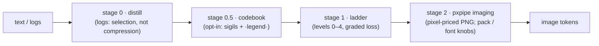

# tanuki-context — design notes

What this project is, why each piece exists, and the logic behind it.
Companion to [README.md](README.md) (usage) — this is the *why*.

> **Branch note** - two engines at parity. `main` is the TypeScript npm
> package (`src/*.ts`); the [`rust` branch](../../tree/rust) carries the same
> pipeline (`src/*.rs`) as a single static binary. They are held byte/pixel-
> exact by `reference/parity-ts.mjs` (distill stats, every estimate knob combo,
> render JSON + pixel-exact PNGs, a full MCP session) - recency-tiered proxy
> imaging, the credential refuse-to-render gate, brief-by-default tool
> descriptions, and the slim default tools/list all live in both. Only the npm
> packaging and the Claude Agent SDK glue are TS-only. Every design decision
> below applies to both.

## 1. Origin

[pxpipe](https://github.com/teamchong/pxpipe) exploits one pricing fact: an
image's token cost is fixed by its **pixel dimensions**, not by how much text
is inside it. Dense text rendered as a PNG costs a fraction of the same text
sent as tokens (~3+ chars per image-token vs ~1 char per text-token on real
traffic). pxpipe ships that as a transparent Anthropic proxy.

We first ran it as that proxy. It worked (measured 76.5% input-token cut on
real traffic), but the proxy relocates the system prompt into a user-turn
block labelled `<system-reminder> … not written by the user` — which reads
exactly like a prompt injection. A security-conscious agent flagged it and
refused its own configuration. That failure mode is structural, not a bug:
a transparent rewriting proxy *is* indistinguishable from an attacker to the
model it serves.

So the design moved from **implicit** (proxy rewrites everything) to
**explicit** (the model calls a tool when it wants the cut). First as a node
MCP wrapping pxpipe's library, then as a single-binary Rust rewrite (now the
`rust` branch), then — after distribution won the argument — as the
zero-dependency TypeScript package on `main`. The imaging stage keeps the
`pxpipe` name: the mechanic is theirs. (Implicit mode later returned with
rules — see "the middlebox, readmitted" below.)

## 2. The pipeline

Three stages, strictly ordered, each optional. The order is the point:
**image tokens are priced by pixels, and pixels are proportional to
characters** — so every character removed by an earlier stage multiplies
through the later ones. Distill −55% then imaging −78% compounds to −90%,
not −78%.

### Stage 0 — distill (for logs and command output)

Borrowed logic from [context-mode](https://github.com/mksglu/context-mode):
don't *compress* noise, **drop** it — but deterministically, with exact
accounting, and no model in the loop. Three passes:

1. **Consecutive block collapse.** Logs repeat in cycles (`opened / closed /
   COMMAND=…`), not just single lines. After masking volatile tokens
   (timestamps, uuids, hex runs, numbers+units → `<ts> <uuid> <hex> <n>`),
   repetitions of 1–8-line blocks collapse to the first block +
   `[×N similar]`. Chronology preserved.
2. **Global near-dupe suppression.** Interleaved noise defeats pass 1 (a
   3-line cycle where one line varies — real `sudo` logs do exactly this).
   Two tiers: an **exact** masked key, then a **coarse template** key
   (non-alpha tokens → `<v>`, so 1.6M distinct file paths in an rclone log
   unify into one `Copied (new)` template). First 2–3 occurrences of each
   key stay in place; the rest are dropped and reported in a trailing
   summary with exact counts (`×375,347 …Copied (new)…`).
3. **Query slice** (optional). A regex keeps matching lines ± context with
   `… N lines omitted` markers — search-instead-of-read.

**Hard invariant:** any line matching the important pattern
(err/error/exception incl. CamelCase `TypeError`, warn, fail, panic, fatal,
traceback, denied, refused, timeout, assert, segfault — plural/suffix forms
included) is *never* collapsed, suppressed, or reworded. On a real journal:
0 important lines lost, verified by set-difference against the input.

Why selection beats compression here: a 126 MB rclone log is ~99% the same
three events. Imaging it raw still pays for every repeat (−78%); distilling
first removes the repeats *before* they reach the renderer (−99.2%), while
the summary table keeps every distinct event type visible with its true
frequency. Information density goes up, not down.

### Stage 1 — ladder (graded, caller-chosen loss)

Text-level compression as an explicit loss dial, each level a superset of
the previous:

| level | name | loss | what it does |
|---|---|---|---|
| 0 | none | none | passthrough |
| 1 | whitespace | lossless | trailing whitespace, blank-run collapse — safe for code |
| 2 | prose | light | collapse spaces, cut filler phrases ("in order to"→"to") |
| 3 | dense | medium | drop articles and intensifiers |
| 4 | caveman | heavy | telegraphic: drop function words — gist only |

**Exact-recall guard (from level 2 up):** a line is passed **verbatim** if it
is indented (code), symbol-dense (>30% non-prose characters — JSON, log
lines), or contains any whitespace-free token ≥24 chars (hashes, paths,
URLs, ids). Loss only ever touches prose. This is why L1–L4 measure ~0% on
source code: that's correctness, not weakness — the guard refusing to
reword what must survive byte-exact.

The lossy levels are the safe subset of "Caveman"/token-optimizer-style
prompt compression. We evaluated and rejected model-based token pruning
(LLMLingua): it deletes tokens it judges unimportant, which is exactly
the silent-confabulation risk pxpipe's own findings warn about. A
deterministic, inspectable ladder with a protected-line guard gives the
same win on prose without gambling exact strings. (An earlier revision
lumped rtk into that rejection — wrong, and corrected below: rtk is
deterministic rule-based filtering, not model-based pruning, and 0.4.0
adopts two of its ideas.)

### Stage 2 — pxpipe imaging

A faithful port of pxpipe's production dense renderer:

- **reflow**: strip trailing whitespace, collapse blank runs, expand tabs to
  4-col stops (`→` marker), then join hard newlines with the `↵` sentinel so
  short lines *pack* into full-width rows instead of wasting a row each.
  Lossless at the transform level — `↵` marks every original newline, so the
  text is reconstructable. Pre-existing `↵` in the source is swapped to `⏎`
  first so the sentinel can't collide.
- **wrap** at 312 columns, by codepoint; wide (CJK) glyphs take 2 cells.
- **page**: ≤90 rows / 28,080 chars per page → 1568×728 px max (Anthropic's
  no-resample bound; 56×26 = 1,456 tokens/page under the 28-px patch grid).
- **blit**: 5×8 anti-aliased glyph cells (max-blend coverage), invert to
  black-on-white, grayscale PNG.

Glyphs are not re-rasterized: they are **extracted from pxpipe's own
generated atlas** (`tools/gen-glyphs.mjs`), so pages are pixel-faithful to
the reference — which is what makes token parity *exact* rather than
approximate. On top of pxpipe's BMP coverage (Spleen 5×8 + Unifont) we add
the **astral planes** from GNU `unifont_upper` (16×16/8×16 1-bit bitmaps
box-filtered to the same 10×8/5×8 AA cells), so emoji and plane-1+ symbols
render instead of dropping — the one place tanuki deliberately exceeds the
reference. Unassigned codepoints become readable `[U+HEX]` escapes (pxpipe
v0.11 semantics); invisible formatting codepoints (zero-width, variation
selectors, combining marks) blit as blank cells. Nothing drops silently.

**pxpipe v0.11 sync** (adopted upstream changes, 2026-07): image tokens are
billed by Anthropic's documented **28×28-px patch grid** — `Σ ⌈w/28⌉×⌈h/28⌉`
per page — replacing the older `pixels/750` fit (a ~4–5% continuous
approximation of the same 784 px²/patch grid; pages never exceed the standard
tier's 1568-px/1568-token limits, so the pre-billing downscale never fires).
The atlas carries upstream's **glyph surgery**: Spleen 5×8 `K` repainted
diagonal-legged (was Hamming-1 from `H`, the atlas's worst confusable; now
Hamming-8 — upstream's paired A/B cut K→H confusions 42→1). And missing
glyphs escape as `[U+HEX]` per upstream #96. Both engines keep the px/750
model, so the parity harness compares every field byte-exact - token-derived
(`imageTokens`, `totalSavedPct`, `verdict`), geometry, chars, pages, and
pixels all match.

### Stage 2 extensions (tanuki-only, parity-safe)

Three knobs push density past the faithful port. They are off the parity path
by construction: `pack=false, font=Normal, codebook=false` renders
byte-identical to pxpipe (25/25 parity rows still pass), so the wins are
strictly additive. All numbers below are measured via the binary's `estimate`
and reproduced by `reference/methods-report.mjs`.

- **pack** (default on) — a tighter, still-lossless reflow. Tabs collapse to a
  single `→` cell instead of padding to a 4-col stop; a leading-space run of N
  becomes `⇥` + one count symbol (`⇥N`) instead of N cells; and each page is
  **width-trimmed** to its widest actual row instead of always paying for a
  1568-px-wide row. Reconstruction stays byte-exact (`↵`=newline, `→`=tab,
  `⇥N`=indent); pre-existing `→`/`⇥` are swapped to literal stand-ins first,
  exactly as reflow already does for `↵`. A round-trip unit test proves it.
  Measured: **−5% image-tokens on source code, −0% on prose** — prose has no
  indent runs to pack, width-trim only helps pages no row fills, and the
  28-px patch grid quantizes away part of the old px-exact trim win.

- **codebook** (opt-in) — the direct, legitimate inversion of the base64
  "models negotiate an encoding in-context" finding: not obscurity but a
  private high-density notation *for cost*, kept documented. Between distill and
  ladder, recurring long tokens and path prefixes (≥12 chars, ≥3×, net-positive
  only) are replaced by single-cell sigils defined once in a trailing `·legend·`
  line. Because every atlas codepoint costs one flat cell, a 60-char path prefix
  seen 30× collapses to 30 cells + one legend entry. Measured: **−40% on a
  path-heavy log**, **−10% on code** (repo paths and long identifiers repeat
  enough to clear the legend cost), ~0 on plain prose.
  Validated for the oversight property the paper actually worries about:
  a vision model read the `·legend·` line and reconstructed the first log line
  **byte-exact** — model-readable and inspectable, not a covert channel.

- **tiny 4×6 font** (opt-in, experimental) — the "the tokenizer itself" lever.
  The same atlas glyphs are box-filtered from the 5×8 cell into a 4×6 one
  (390 cols × 120 rows/page vs 312 × 90), so the same text needs fewer pixels.
  Measured: **−40–43% image-tokens** across every sample kind. The cost is the
  density↔accuracy frontier the report names: at 4-px width a vision read-back
  scored **99.7% char-accuracy** with a single `M`→`H` glyph confusion. So it
  ships opt-in and gated — fine for logs and bulk prose; verify before trusting
  it with `M_`/`H_`-sensitive identifiers.

Stacked (`pack + codebook + tiny`) the log class reaches **−65%** below the
pxpipe baseline, source code **−43%**, prose **−40%** (28-px patch model).

Two further properties:

- **append-stable pages.** Reflow is deterministic left-to-right, so appending
  content leaves every earlier page byte-identical (verified by hashing). That
  lets prompt-caching price the unchanged pages at cache rates across turns —
  the biggest lever in the base64 report, stacked on the imaging cut.
- **still rejected: model-based pruning.** LLMLingua stays out for the same
  reason as before — it deletes tokens it *judges* unimportant, the
  silent-confabulation risk. pack and codebook are deterministic and
  reversible; that line holds.
- **adopted from [rtk](https://github.com/rtk-ai/rtk)** (deterministic,
  rule-based — an earlier note here misfiled it next to LLMLingua): the
  wrapper shape and progress-frame truncation. `tanuki-context run -- <cmd>`
  passes the exit code through, prints distilled output inline, and stashes
  the full capture past an 8,000-char budget, so nothing is unrecoverable.
  Distill now also collapses `\r` progress frames to the final one — what a
  real terminal would have shown (a lone trailing `\r` is CRLF and is
  stripped, not collapsed). rtk's per-command parsers for 100+ tools stay
  rtk's; our wrapper is the generic fallback and the two stack.
- **`recommend` reshaped in 0.4.0 after the benchmark caught it.** The walk
  used to label its cheapest combo "safe" — and on source code it picked
  distill, which collapses similar-looking lines. Cheapest and safe are
  different claims: the headline now walks reversible knobs only, and the
  distill route is priced separately under `withDistill`.
- **`recommend`: the knob walk is server-side.** Tool chatter is context
  too: probing the knob combos by hand costs ~590 tokens of estimate
  rounds, and the tool-call overhead of using tanuki is as real as the
  text it compresses. So every estimate walks the combos itself (level 0,
  in-process, no pixel work) and returns the first rung that holds, plus
  the tiny-font price for anyone willing to trade read-back accuracy. The
  same lazy-engineering rule that shaped the pipeline — stop at the
  cheapest step that suffices — applied to the protocol around it.
- **stash + fetch: the retrieval pattern, absorbed.** Inspired directly by
  [context-mode](https://www.npmjs.com/package/context-mode)'s model —
  content parked outside the window, queried on demand — after measuring it
  head to head. Retrieval's two weak spots are awareness (a blind store; the
  model must guess what to ask) and big answers (returned at full text
  price). `tanuki_stash` fixes the first with a ~300-token deterministic map
  (distill stats, top repeats, first/last lines, a content-address id);
  `tanuki_fetch` fixes the second by running slices through the proxy gate —
  pages when they win by ≥25%/300 tokens, text otherwise. Content-addressed
  ids (sha256/12) make re-stashing free. Measured on the 200 KB journal:
  map 305 tok; the every-failure-line slice 4,704 as pages vs 22,111 as
  text. Storage is `$TANUKI_STASH` or `~/.tanuki/stash`, plain files, the
  user's own bytes.
- **table: whole-JSON columnar — the SmartCrusher answer.** The one domain
  where [headroom](https://github.com/headroomlabs-ai/headroom)'s
  SmartCrusher genuinely beat our line tools was structured JSON (60-95%
  structural dedup). tanuki's version is deterministic and value-lossless:
  when the WHOLE input is a JSON array of ≥2 objects or pure NDJSON, emit a
  `·cols·` header (keys stated once, JSON-quoted, tab-joined) and one line
  per row of tab-separated compact-JSON cells. An absent key is an empty
  cell — a JSON cell is never empty, so the grammar is unambiguous; compact
  JSON escapes control chars, so a raw tab cannot appear inside a cell.
  Round-trip contract is *same values, canonical layout* (sorted columns and
  sorted nested keys — deliberately matching serde_json's BTreeMap so both
  engines emit identical bytes; source key order does not survive Rust's
  parser anyway). `tableDecode` ships as the escape hatch and the round-trip
  test. A size gate keeps tiny/mixed inputs as text, `recommend` probes the
  knob on every estimate, and uniform rows then collapse harder under
  distill/codebook. Measured on a fresh 200 KB `journalctl -o json` slice:
  imaging alone 10,752 image-tokens; + table 7,280; + codebook 5,320 (−90%
  vs 51,182 raw). Mixed prose+JSON stays text by design — block-level
  detection is the upgrade path if a real corpus demands it.
- **situation-aware cost (`estimate` model/cached): the "codeburn calculation."**
  The verdict compared token *counts* — `imageTokens < rawTextTokens` — which
  equals real cost only when both sides bill at the same per-token rate. On
  Anthropic they do *uncached* (image/visual tokens bill at the input rate), so
  the count was a correct proxy there and still is. It is wrong in the two spots
  §5/§6 already flagged in prose: **cached** content (a cache-read token costs
  ~0.1× a fresh one, so imaging content that would ride the cache is a net loss)
  and **non-Anthropic** providers (images priced on a different, tile-based
  count). Borrowed from [codeburn](https://github.com/getagentseal/codeburn),
  which prices every call by real input/output/**cache-read**/cache-write rates
  because not all tokens cost the same; and from
  [headroom](https://github.com/headroomlabs-ai/headroom)'s content-router
  premise that the *decision* should be situation-aware, not one fixed
  threshold. Passing `model` and/or `cached:true` to `tanuki_estimate` adds a
  `cost` block (real dollars, `cheaper`, `savedPct`, `breakevenImageTokens`).
  Only the *ratios* (cache-read, image) drive the verdict; absolute $/Mtok are
  labeled list prices (`RATES_AS_OF`) overridable via `TANUKI_RATES`, so a price
  drift is a config edit, not a code change — the calibration knob a real price
  table needs. Since 0.6.0 image-token *counts* are provider-correct too:
  `estimateText` exposes per-page pixel dims (pack width-trims pages, so dims
  are real, not assumed), and the cost model counts OpenAI pages by the
  high-detail tile rule (85 + 170 per 512-px tile after the documented 2048/768
  downscales) and Gemini pages at 258 per 768-px tile — flagged `~approximate`
  because Gemini's crop rule has undocumented edges; their usage field is
  authoritative. Measured on the 200 KB journald slice: a full 1568×728 page is
  1456 Anthropic patches, 1445 OpenAI tile-tokens, 774 Gemini tile-tokens —
  Gemini pages are half price, which the verdict now sees instead of guessing.
  With no dims supplied the count falls back to the patch grid and the note
  says so. Gated by
  construction: no `model`/`cached` argument ⇒ no `cost` field, so the default
  result and the parity harness stay byte-identical. Rejected from both sources:
  Headroom's output-token steering (verbosity notes, effort routing) is model
  behavior, not deterministic accounting — the same LLMLingua line we hold; and
  codeburn's live LiteLLM price fetch would break the zero-dependency claim, so
  hardcoded fallbacks + an env override stand in.
- **output share: reported, never steered.** Headroom's other lever is
  output-token steering (verbosity notes, effort routing) — model behavior,
  rejected above with LLMLingua. The deterministic remainder is accounting:
  the proxy already scrapes usage, so it now also records `output_tokens`
  (max across SSE frames — `message_start` carries a placeholder,
  `message_delta` the final count) and `tanuki_stats` reports
  `outputSharePct`, the share of the bill no input-side tool can cut. On
  Opus-class pricing output runs 5× input, so this line is the honest answer
  to "why didn't my bill halve": it tells you when tanuki is the wrong
  lever, in numbers.
- **verbatim sidecar: fidelity priced, not promised.** The needle harness
  (`reference/needle-report.mjs`, README Table D) measured what a Reddit
  reviewer predicted: model read-back of dense random strings from pixels
  fails *silently* — 5/10 grep-targets at normal density, 3/10 at tiny,
  every miss one plausible character. pxpipe's factsheet was the fidelity
  feature we lacked; `verbatim` (default on) is our answer: scan the exact
  text the pages carry (post-pipeline, so line numbers match and codebook
  legends are covered) for uuid/digest/0x/frame/hex-run/ipv4/semver
  needles, ship them as a `·verbatim·` text block next to the image
  blocks — `L<line> <value>`, first occurrence per distinct value, capped
  at 32 with an honest `+N more`. The estimate verdict adds sidecar tokens
  to the image side, so a needle-dense file tips back to "TEXT cheaper"
  instead of shipping unreadable hashes. Same scanner in both engines
  (ASCII regex semantics, no lookarounds), sidecar byte-identical under
  the parity harness; harness coverage check pins 20/20 on the seeded
  corpus every run.
- **the honest ledger: counterfactual accounting, named and bounded.** The
  rakuen post ("Token compression tools measure the wrong thing") is right
  about the category and was right about us: `estInputSavedPct` prices every
  avoided token at the full input rate, which overstates savings on a
  97%-cached session by up to 10×, and no table measured task success. Fixes,
  in layers. (1) The rate table gained `cacheWriteMult` (~1.25×; the OpenAI
  read rate corrected 0.5→0.1 per the post), and a `cached` verdict now
  prices fresh pages at the write premium — cached breakeven moved 100→80 on
  a 1000-token block. (2) The proxy keeps a per-process `ProxySession` —
  sha256s of imaged blocks plus a caching-seen flag, LEDGER-ONLY by
  construction (bytes never depend on it; a cross-request rewrite would bust
  the client's cache, so cross-request pointer dedupe was rejected). Once
  cache traffic is observed, replayed blocks book at the provider's
  cache-read rate and a block's first text→pages flip books negative at the
  write premium, recouping ~(raw−pages)×0.1 per later turn. Events carry
  `saved_tokens_cache_aware`; `tanuki_stats` reports both bounds and
  `toolFurnitureTokens`, our own schemas counted against ourselves
  (`TANUKI_TOOL_BRIEF=1` serves registry briefs, −46%). (3) The default
  imaging gate is UNCHANGED — steady-state still favors smaller cached
  pages, so this is measurement honesty, not a savings retreat. (4) What no
  ledger can claim, `reference/paired-report.mjs` measures: cost per
  successful task in paired arms with byte-exact success checks. We ship
  the harness and refuse to ship a percentage — printing one from our own
  machine would be the exact `rtk gain` move the post indicts.

### Implicit mode — the middlebox, readmitted with rules

Section 1 explains why we left the proxy model: pxpipe relocates the system
prompt into a user-turn wrapper that reads like an injection, and an agent
refused it. That verdict was about the *relocation*, not about middleboxes as
such. `tanuki-context proxy` brings the deployment shape back (point
`ANTHROPIC_BASE_URL` at it, zero client changes) under five rules that keep
the rewrite recognizable and consensual in spirit:

1. system prompt and tool definitions are never touched;
2. nothing moves between roles or positions — an oversized text block becomes
   an overt `[tanuki-context: …]` marker plus PNG pages *in the same slot*
   (Anthropic allows image blocks in user content and inside tool_results);
3. the latest message is never imaged (the model may need to quote it);
4. `cache_control` blocks are never touched (rewriting defeats their cache);
5. imaging happens only when `estimate` wins by a margin (default ≥25% and
   ≥300 tokens); everything else forwards byte-for-byte.

One reuse rule sits on top: a block byte-identical to one already imaged in
the same request is not imaged again — it becomes a one-line pointer to the
pages above. Agent transcripts repeat themselves (the same file read three
times, the same build output pasted twice), and the cheapest page is the one
you don't re-send. Exact matches only, so the rule is as deterministic as
the rest; near-duplicates image independently.

Responses stream through untouched; usage is scraped from the stream and the
savings row appended to the same events log `tanuki_stats` reads, with the
baseline defined as actual billed tokens plus the estimated text cost of the
imaged blocks. Explicit MCP mode remains the default and the recommendation;
the proxy exists for clients you can't modify. Wire behaviour is covered by
`test/proxy.test.ts` (transform rules unit-tested, plus a live
proxy-to-mock-upstream session asserting passthrough and the events row).

### Claude Agent SDK surface

`tanuki-context/agent` exists because "add this MCP server" is still friction
for someone wiring a team of agents. It ships two shapes: `withTanuki(options)`
merges a stdio server config plus `allowedTools` into an Agent SDK options
object (zero dependencies, resolves the installed `dist/cli.js` directly so
there is no npx cold start), and `tanukiSdkServer()` builds an in-process
server via the SDK's `createSdkMcpServer` — one instance shared by every
agent in the process instead of a subprocess per session. The SDK and zod are
optional peer dependencies touched only behind a dynamic import, so the core
package keeps its zero-dependency claim; any Agent SDK project already has
both (zod is the SDK's own peer). `TANUKI_INSTRUCTIONS` carries the
estimate-first workflow and the decode grammar as a canned prompt block —
the piece that actually makes fleets of agents use the tools instead of
pasting logs. The entry split (`src/cli.ts` runs `main()`; `src/main.ts` is
now an importable library) is what makes this module possible without
starting a server as an import side effect.

### Client wiring (OMP, jcode, pi)

MCP-native clients (OMP, jcode, Claude Code) need only a config entry; the
README carries the exact snippets. pi is the interesting case: it has no MCP
layer at all — tools come from TypeScript extensions. Rather than duplicate
the pipeline behind pi's tool API, `src/pi.ts` is a ~180-line stdio JSON-RPC
client that spawns a `tanuki-context` server and forwards `tools/call`
verbatim; pi's `ToolResult` content blocks are structurally identical to
MCP's (`{type:"text"|"image", data, mimeType}`), so results pass through
untouched. That thinness is what makes the extension engine-agnostic:
`TANUKI_BIN` swaps the spawned server for the Rust binary and nothing else
changes — one code path, both engines, and the parity harness guarantees the
numbers match. The npm package doubles as a pi package via the `"pi"`
manifest field (`pi install npm:tanuki-context`); `typebox` stays out of the
runtime dependencies because pi provides it to extensions (documented
"Available Imports"), preserving the zero-dependency claim.

## 3. The Rust chapter (and why `main` is TypeScript now)

The MCP is stdio: clients spawn it per session, so **startup latency and
resident memory are the product**, not just throughput. Before the first
rewrite, options were benchmarked on this machine's real workload (126 MB
log distill): node 4.20 s, bun 3.48 s, rust 2.44 s (2.31 s final). Go was
ruled out on regex-engine throughput; Zig/C on ecosystem risk for zero
additional win over Rust. The Rust numbers against the node reference, as
measured at that first rewrite (the binary has since grown to 5.7 MB with
rustls for the proxy):

| metric | node reference | tanuki (rust) |
|---|---:|---:|
| distill 126 MB log | 4.21 s | **2.31 s** |
| full pipeline per level | 85 ms – 3.05 s | 59 ms – 1.97 s (**1.4–1.7×**) |
| MCP first response | ~150 ms | **~3–16 ms** |
| server RSS | 177 MB | **3 MB** |
| deployable | node + node_modules | **one ~3.3 MB static binary** |

Two implementation choices keep it light:

- **No async runtime, no MCP SDK.** Stdio MCP is newline-delimited JSON-RPC
  with four methods (`initialize`, `tools/list`, `tools/call`, `ping`) — a
  blocking read loop and `serde_json` cover it in ~80 lines. tokio would buy
  nothing for a serial stdio protocol and cost megabytes.
- **Lazy atlas.** Codepoints + wide flags load eagerly (~180 KB, needed for
  wrap math); the 6.8 MB of AA coverage stays zlib-packed (0.88 MB) inside
  the binary and inflates only on the first actual blit. `tanuki_estimate`
  computes exact page geometry without ever touching pixel data.

Honest reading: the pipeline speedup is 1.4–1.7×, not 10× — PNG deflate
dominates and both zlib implementations are good. The decisive wins were
startup (~10×), memory (~60×), and deployment (one binary).

Then distribution won: `npx tanuki-context` beats "download a binary for
your platform" for MCP users, and a careful TS port stayed close enough to
Rust where it matters. Re-measured 2026-07-26: 12 MB distill 0.31 s (bun) /
0.42 s (node) vs 0.28 s (rust); spawn to first MCP response 27/35 ms vs the
node reference's 158 ms; idle RSS 50/87 MB vs 177 MB; 0.98 MB tarball, zero
runtime dependencies. So
`main` became the 1:1 TypeScript port (proven byte/pixel-identical by
`reference/parity-ts.mjs`), and the Rust implementation lives on as the
`rust` branch, maintained at parity for anyone who wants the static binary.

## 4. Parity as a discipline

Nothing got deleted when an implementation was superseded: the node MCP
moved to `reference/node-mcp/` and the Rust pipeline to the `rust` branch,
and both became test oracles. Three harnesses:

- `reference/parity-ts.mjs` — TS vs the `rust`-branch binary: distill stats
  deep-equal, every estimate knob combo, render JSON + pixel-exact PNGs
  (IDAT inflated and byte-compared), and a full MCP session including error
  paths. Both sides bill the same 28-px patch grid, so estimate JSON is
  compared field-for-field.
- `reference/parity.mjs` — the original node-vs-rust harness; asserts distill
  counts (runs, exact-tier, template-tier, important-kept) and render
  geometry (pages, image tokens).
- `reference/benchmark.mjs` — the full timed matrix (every level × every
  sample, both engines in-process, median of 3 with discarded warmup) →
  `benchmark-report.html`. Parity is asserted per row: **25/25 pass**.

Getting to *identical* (not "close") surfaced three real porting lessons:

1. **Regex class semantics.** JS `\d`/`\w`/`\b` are ASCII; the Rust `regex`
   crate defaults to Unicode-aware classes (and is much slower for them).
   Porting to explicit ASCII classes + `(?-u:\b)` fixed both a correctness
   drift *and* a 2.6× slowdown at once.
2. **`split(/\s+/)` emits empty edge tokens.** An indented line splits to
   `["", "at", …]` in JS — that leading `""` becomes `<v>` in the coarse
   template key. Rust's `split_whitespace()` doesn't do that, so indented
   and unindented twins grouped differently: a 3-line count drift on 1.6M
   lines. Replicating JS's exact split semantics made the 126 MB template
   tier byte-identical (560,779 = 560,779).
3. **Geometry is data, not code.** Extracting the atlas instead of
   re-rasterizing the fonts is what made render parity trivially exact —
   same coverage bytes in, same pixels out, same patch count out.

## 5. Fidelity model (what can be trusted when)

| path | guarantee |
|---|---|
| imaging (any level 0/1) | source byte-exact reconstructable (`↵` = newline, `→` = tab, `⏎` = literal ↵) |
| imaging + pack | still byte-exact: adds `⇥N` = indent run to the `↵`/`→`/`⏎` sentinels; pre-existing markers escaped first; a unit test round-trips it |
| distill | error/warn/exception lines verbatim; drops are counted with exact ×N; full log stays on disk |
| ladder L2–L4 | code / indented / symbol-dense / long-token lines verbatim; loss confined to prose |
| ladder L4 | prose is gist-only — never use where verbatim prose matters |
| codebook | reversible: every sigil is defined in the trailing `·legend·` line; validated byte-exact by a vision read-back |
| tiny 4×6 font | legible but lossy at the glyph level (99.7% char-accuracy measured; `M`/`H` confusable) — opt-in, verify before trusting exact identifiers |
| unassigned codepoints | render as readable `[U+HEX]` escapes (invisible formatting codepoints blit as blank cells) — nothing drops silently |
| proxy mode | system prompt/tools/latest message/`cache_control` never touched; in-place rewrites only, marked overtly; text-cheaper requests forward byte-for-byte |
| stats | savings counted against *all* billed input (input + cache reads + cache creates) — ignoring cache reads would fake the number |

That last row is a story of its own: the first stats implementation read
non-existent fields (all zeros), and the second showed 99.6% savings by
ignoring 6.5M cache-read tokens. The honest figure was 76.5%. Every number
this project reports now names its denominator.

**The imaged bulk, priced.** The table above is qualitative; `estimate` also
returns a quantitative `fidelity` band for the config you price. It maps the
imaged compression ratio (text tokens ÷ vision tokens) onto DeepSeek-OCR's
measured read-back curve ([arXiv:2510.18234](https://arxiv.org/abs/2510.18234):
~98% under 8×, ~87% by 12×, ~60% by 20×) and floors the band at `low` for the
4×6 tiny font, which sits past the glyph-legibility cliff regardless of ratio
(our own `reference/tier-report.mjs` sweep reproduces the curve: L0 ≈4× solves
the task, tiny fails even at ≈7×). Exact strings ride the `verbatim` sidecar as
text and are unaffected — the band bounds comprehension of the *imaged* bulk, so
the model reaches for a lossier tier knowingly. It is analytic; the calibrated
per-model version is Upgrades 2–3 in
[docs/research-roadmap-2026-07.md](docs/research-roadmap-2026-07.md).

**Sigils stay confusable-free.** The codebook alphabet is pinned by a guard
test (`test/fidelity.test.ts`, the OCR-B/UTS-39 methodology): every sigil must
be less confusable with any content glyph — measured as L1 coverage distance on
the real 5×8 atlas — than `0` and `O` already are with each other. The current
set clears that bar by ~1.5×; the guard stops a future edit from silently
introducing an `Ø`/`0`-class ambiguity into imaged pages.

## 6. What we'd change with more time

- **High-res vision tier.** Claude 4.7+ models accept 2576-px / 4784-token
  pages; a `tier` knob would nearly double chars-per-page where the reader
  supports it. Needs a transcription-accuracy A/B first, same as tiny font.
- **Multi-provider proxy.** The middlebox speaks Anthropic `/v1/messages`
  only; OpenAI/Gemini image pricing differs enough (32-px patches, tile
  models) that each upstream needs its own gate math.
- **Color/class-tick render variants** (pxpipe has them behind flags; the
  production dense path we ported doesn't use them).
