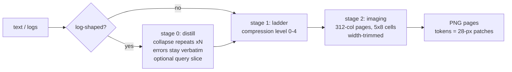
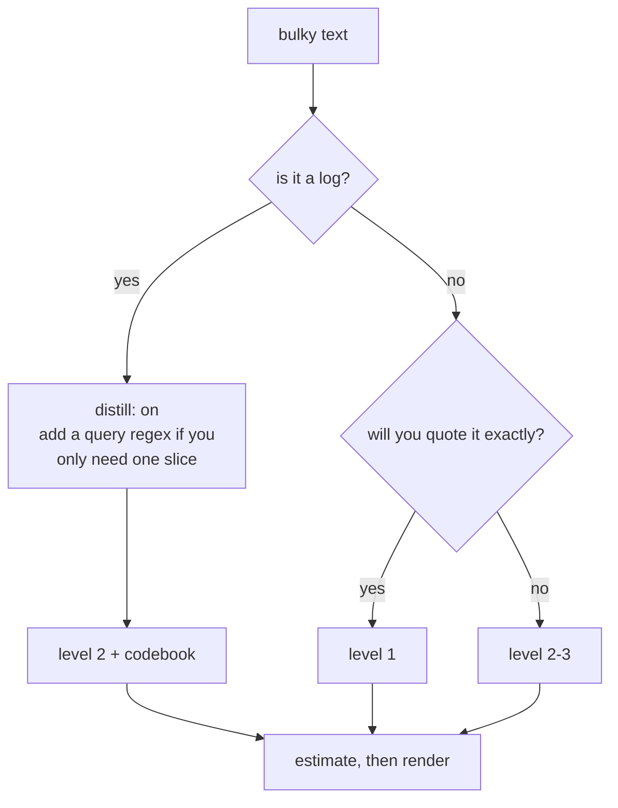

# tanuki-context

[](https://www.npmjs.com/package/tanuki-context)
Zero dependencies. 0.97 MB tarball. Runs anywhere Node >= 18 runs. MIT.

Your model pays roughly 1 token per 4 characters to read text. A rendered PNG
page is billed by Anthropic's 28×28-pixel patch grid (⌈w/28⌉×⌈h/28⌉ visual
tokens), which works out to 3+ characters per token on dense pages.
tanuki-context uses that gap: it takes bulky context (logs, docs, command
output), optionally distills and compresses it, then renders it as dense PNG
pages that a vision-capable model reads at a fraction of the cost.

A 200 KB noisy journal log (1,623 lines), measured:

| how it enters context            |         tokens |     saved |
| -------------------------------- | -------------: | --------: |
| pasted as raw text               |         51,168 |         0 |
| rendered as pages                |         10,752 |  **-79%** |
| distilled first, then rendered   |          6,160 |  **-88%** |
| distilled + codebook + tiny font |          2,576 |  **-95%** |

```
npx tanuki-context
```

## Quick start

Register it as an MCP server in any client:

```json
{ "mcpServers": { "tanuki-context": { "command": "npx", "args": ["-y", "tanuki-context"] } } }
```

Or try the CLI on one of your own files first. `estimate` is instant and tells
you up front whether the pipeline wins:

```
npx tanuki-context estimate build.log 2 --distill --codebook
# → { "imageTokens": 4312, "rawTextTokens": 51168, "verdict": "PIPELINE cheaper", ... }
npx tanuki-context render build.log 2 ./pages --codebook
# → ./pages/page0.png ...
```

## How it works



Three stages, each optional except the last:

**Stage 0, distill.** Built for logs. Repeated lines and multi-line block
cycles collapse to one exemplar plus a `xN` count; near-duplicates that differ
only in timestamps, ids, or numbers fold into a template. Error and warning
lines never get touched. A `query` regex returns only the slice you care
about, with context. Measured on the 200 KB log above: 1,624 lines to 890,
43% fewer characters, all 272 important lines kept verbatim.

**Stage 1, the ladder.** Five compression levels, from passthrough to
telegraphic. From level 2 up an exact-recall guard keeps code, identifiers,
hashes, and paths verbatim: only prose gets shorter. Measured on wordy prose
(821 tokens):

| level | name       | loss     | what it does                                    | tokens out |
| ----: | ---------- | -------- | ----------------------------------------------- | ---------: |
|     0 | none       | none     | passthrough baseline                            |        821 |
|     1 | whitespace | lossless | trailing whitespace, blank-line runs; safe for code | 821    |
|     2 | prose      | light    | L1 + collapse spaces, cut filler phrases        |  794 (-3%) |
|     3 | dense      | medium   | L2 + drop articles and intensifiers             | 708 (-14%) |
|     4 | caveman    | heavy    | L3 + drop function words; gist only, not verbatim | 534 (-35%) |

Rule of thumb: level 1 for code, level 2 for anything you may need to quote,
level 3 for reference material, level 4 when only the gist matters.

**Stage 2, imaging.** The renderer packs text into 312-column pages of 5x8
antialiased cells (1568 x 728 px max, short pages get width-trimmed) and
encodes grayscale PNGs. Full Unicode: 92,812 codepoints including CJK,
Cyrillic, and emoji / astral planes. Unassigned codepoints render as readable
`[U+HEX]` escapes (pxpipe v0.11 semantics), so nothing disappears silently.

### Picking a route



## Density knobs

All measured against the baseline renderer, all reversible or
legend-decodable:

| knob                | what it does                                                                | code | prose |  log |
| ------------------- | --------------------------------------------------------------------------- | ---: | ----: | ---: |
| `pack` (default on) | single-cell tabs, `⇥N` indent runs, width-trimmed pages; byte-exact         |  -5% |   -0% |  -0% |
| `codebook`          | repeated tokens and path prefixes become 1-cell sigils plus a `·legend·` line | -10% |  -0% | -40% |
| `font: "tiny"`      | glyphs box-filtered into 4x6 cells; 99.7% read-back, skip it for exact code  | -43% |  -40% | -40% |
| all three stacked   |                                                                              | **-43%** | **-40%** | **-65%** |

## Tools (MCP, stdio)

| tool             | arguments                                                       | returns                                        |
| ---------------- | --------------------------------------------------------------- | ---------------------------------------------- |
| `tanuki_render`   | `text, level?, distill?, query?, pack?, font?, codebook?`       | PNG page blocks + savings breakdown            |
| `tanuki_estimate` | same as render                                                  | exact page geometry and token math, numbers only |
| `tanuki_distill`  | `text, query?`                                                  | stage 0 alone; output stays greppable text     |
| `tanuki_compress` | `text, level`                                                   | stage 1 alone                                  |
| `tanuki_stats`    | none                                                            | savings summary from the session event log     |

`estimate` never touches pixel data, so it is safe to call on everything and
only render when the verdict says the pipeline wins.

## Implicit mode (proxy)

If you can't touch the client, tanuki can also run as a local middlebox, the
way pxpipe deploys, but with rules that avoid the injection-shaped rewrite
that made us leave the proxy model in the first place:

```
npx tanuki-context proxy                    # listens on 127.0.0.1:8484
export ANTHROPIC_BASE_URL=http://127.0.0.1:8484
```

What it does to a `/v1/messages` request: oversized text blocks in user
messages and tool results are replaced **in place** by a short visible marker
plus PNG page blocks, only when `estimate` says imaging wins by a clear
margin (default: at least 25% and 300 tokens cheaper). What it never does:

- touch the system prompt or tool definitions
- move content between roles or positions
- image the latest message (you may need to quote it)
- rewrite blocks carrying `cache_control` (that would break their cache)
- rewrite anything when text is cheaper; those requests pass byte-for-byte

Responses stream through untouched. Savings are logged to
`~/.pxpipe/events.jsonl` (same format `tanuki_stats` reads), with the
baseline named: what Anthropic billed plus the estimated cost of the imaged
blocks as text.

Knobs: `--port N` `--upstream URL` `--level 0-4` `--distill` `--codebook`
`--font tiny` `--min-chars N` `--ratio X` `--min-save N` `--max-pages N`.
Defaults are conservative: level 0, no distill, no codebook, normal font.

## Claude Agent SDK

`tanuki-context/agent` makes the whole pipeline a one-liner for agents built
on the [Claude Agent SDK](https://github.com/anthropics/claude-agent-sdk-typescript),
in either of two shapes.

External (subprocess per session, zero extra dependencies):

```ts
import { query } from "@anthropic-ai/claude-agent-sdk";
import { withTanuki } from "tanuki-context/agent";

for await (const msg of query({ prompt: task, options: withTanuki({ model: "claude-..." }) })) {
  // agent now has tanuki_estimate / tanuki_render / tanuki_distill / ...
}
```

In-process (no subprocess; one server instance shared by a whole team of
agents in the same process):

```ts
import { tanukiSdkServer, tanukiAllowedTools, TANUKI_INSTRUCTIONS } from "tanuki-context/agent";

const tanuki = await tanukiSdkServer(); // needs the SDK + zod, which agent projects already have
const options = {
  mcpServers: { tanuki },
  allowedTools: tanukiAllowedTools(),
  systemPrompt: { type: "preset", preset: "claude_code", append: TANUKI_INSTRUCTIONS },
};
// hand the same `options` to every agent in the team
```

`withTanuki(options?)` merges into existing options without clobbering other
servers or allowed tools; `TANUKI_INSTRUCTIONS` is a canned prompt block that
teaches agents the estimate-first workflow and the page decode grammar. The
core package stays zero-dependency: the SDK and zod are optional peers,
touched only inside `tanukiSdkServer()`.

Python SDK: plain dict config, no extra package needed:

```python
from claude_agent_sdk import ClaudeAgentOptions

options = ClaudeAgentOptions(
    mcp_servers={"tanuki": {"command": "npx", "args": ["-y", "tanuki-context"]}},
    allowed_tools=[f"mcp__tanuki__tanuki_{t}" for t in
                   ["render", "estimate", "distill", "compress", "stats"]],
)
```

## CLI

```
npx tanuki-context                          # MCP stdio server (default)
npx tanuki-context proxy [--port 8484] [--upstream URL] [knobs]   # implicit middlebox
npx tanuki-context distill <file> [query]   # stats JSON to stdout
npx tanuki-context estimate <file> [level] [--distill] [--no-pack] [--font tiny] [--codebook]
npx tanuki-context render <file> [level] [outdir] [--no-pack] [--font tiny] [--codebook]
npx tanuki-context bench <file> <distill|pipeline> [level] [runs]   # in-process timing
```

## Footprint

Measured on the same machine as the tables above:

| metric                       | tanuki-context               | pxpipe node server |
| ---------------------------- | ---------------------------- | ------------------ |
| spawn to first MCP response  | 86 ms (bun) / 106 ms (node)  | 152 ms             |
| idle server RSS              | 50 MB (bun) / 80 MB (node)   | 177 MB             |
| distill a 113 MB log         | 3.35 s                       | ~4 s               |
| install                      | 0.97 MB tarball, zero deps   | node_modules tree  |
| emoji / astral planes        | rendered                     | escaped as `[U+HEX]`  |

The imaging engine is a remake of [pxpipe](https://github.com/teamchong/pxpipe):
page geometry and glyphs come from pxpipe's own generated atlas (Spleen 5x8
for ASCII and code, Unifont for the rest), so pages are pixel-faithful to its
production renderer, and the default path (`pack` off, normal font) stays
byte-identical to it. Astral-plane coverage comes from GNU `unifont_upper`,
box-filtered to the same cells.

## Repository layout

| path                  | role                                                                     |
| --------------------- | ------------------------------------------------------------------------ |
| `src/main.ts`         | MCP stdio server (hand-rolled JSON-RPC) + CLI (entry: `src/cli.ts`)       |
| `src/agent.ts`        | Claude Agent SDK glue: `withTanuki`, in-process `tanukiSdkServer`         |
| `src/distill.ts`      | stage 0: 3-pass log distiller (runs, blocks, template near-dupes, query) |
| `src/ladder.ts`       | stage 1: levels 0-4 with the exact-recall guard                           |
| `src/codebook.ts`     | repeated tokens and path prefixes to sigils plus `·legend·` (opt-in)      |
| `src/render.ts`       | stage 2: reflow, pack, wrap, page split, AA blit, tiny 4x6 font           |
| `src/proxy.ts`        | implicit mode: local Anthropic middlebox, in-place block imaging          |
| `src/atlas.ts`        | glyph atlas (92,812 codepoints): metadata eager, pixels inflated lazily   |
| `src/png.ts`          | minimal grayscale PNG encoder (`node:zlib`, filter-0 rows)                |
| `src/stats.ts`        | event log summary                                                         |
| `assets/glyphs.*`     | generated glyph data (0.4 MB packed)                                      |
| `tools/gen-glyphs.mjs`| regenerates `assets/` from pxpipe's atlas                                 |
| `reference/`          | parity and benchmark harnesses used during development                    |

Architecture notes and the reasoning behind each stage live in
[DESIGN.md](DESIGN.md).

## Build

Runs from source with Bun (`bun src/cli.ts`) or as the bundled,
Node-compatible files:

```
bun run build        # dist/cli.js + dist/agent.js (+ agent.d.ts)
```

Prefer a single static binary with no runtime at all? The
[`rust` branch](../../tree/rust) carries the same pipeline (same patch-grid
token model, escapes, atlas, proxy) as a ~3.3 MB Rust build:

```
git checkout rust && cargo build --release
```

Regenerating glyphs after a pxpipe atlas rebuild (needs a pxpipe checkout with
`dist/` built; the generator fetches `unifont_upper` on first run):

```
PXPIPE_DIST=~/Projects/pxpipe/dist node tools/gen-glyphs.mjs
```
