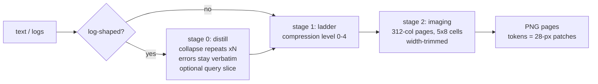

# tanuki-context

[](https://www.npmjs.com/package/tanuki-context)
Zero dependencies. 0.98 MB install. Runs anywhere Node >= 18 runs. MIT.

**AI models charge you for every word they read. tanuki-context turns the
bulky parts of a conversation — logs, command output, long documents — into
compact images the same model reads for a fraction of the price.**

That sounds like a trick, but it is just how the pricing works. Text costs
about 1 token per 4 characters. An image costs a fixed amount set by its
size in pixels, no matter how much text is drawn inside it. So if you pack
28,000 characters of text into one dense 1568x728 image, the model reads it
for 1,456 tokens instead of about 7,000. [pxpipe](https://github.com/teamchong/pxpipe)
discovered how far that gap stretches on real traffic (~3.1 characters per
image token, against ~1 for text) and built a proxy on it. tanuki-context is
the same imaging engine, packaged so the model itself decides when to use it
— plus a relay mode for when you can't change anything.

This is a real page, straight out of the pipeline — 200 KB of system log,
cleaned up and drawn. A vision model reads it directly:


*Four pages like this replace 51,200 tokens of raw text with 5,264 —
a 90% cut. Zoom in: it's all still there, errors verbatim. (Hostnames,
IPs, MACs, and network names were rewritten to placeholders before
rendering; the structure and repetition are untouched.)*

## What you save

Measured on that same 200 KB slice of a real system journal (1,434 lines
from tailscaled, NetworkManager, the kernel, and friends — mixed on
purpose; a plain `journalctl` tail is so repetitive the result looks fake.
Identifiers were rewritten before measuring; the repetition shape and
every error line are untouched):

| how the log enters the conversation | tokens |     saved |
| ----------------------------------- | -----: | --------: |
| pasted as raw text                  | 51,200 |         0 |
| drawn as image pages                | 10,752 |  **-79%** |
| noise removed first, then drawn     |  5,264 |  **-90%** |
| plus codebook and tiny font         |  2,576 |  **-95%** |

Every row is one command on your own file:

```
npx tanuki-context estimate your.log 0
npx tanuki-context estimate your.log 0 --distill
npx tanuki-context estimate your.log 0 --distill --codebook --font tiny
```

`estimate` is instant, never renders anything, and tells you honestly when
plain text would be cheaper.

## Try it in 30 seconds

Claude Code:

```
claude mcp add tanuki-context -- npx -y tanuki-context
```

Any other MCP client:

```json
{ "mcpServers": { "tanuki-context": { "command": "npx", "args": ["-y", "tanuki-context"] } } }
```

No AI client at all, just curious what it would save you:

```
npx tanuki-context estimate some-big-file.log 0
```

## The three ways to run it

**Explicit (MCP tools) — the default and the recommendation.** Your AI gets
seven tools. It calls `tanuki_estimate` on bulky text, reads the verdict,
and renders only when the pipeline wins. The model stays in charge and can
see exactly what happened to every byte. The estimate answer prices the
knobs for you — reversible ones as the headline, the lossy-but-counted
distill route separately, because "cheapest" and "safe" are different
claims:

```
npx tanuki-context estimate journal.log 0
# { "imageTokens": 10752, "verdict": "PIPELINE cheaper",
#   "recommend": { "codebook": true, "imageTokens": 8624, "pages": 6,
#                  "tinyImageTokens": 5208,
#                  "withDistill": { "codebook": true, "imageTokens": 4256 } }, ... }
```

**Implicit (proxy) — for clients you can't modify.** A small local relay.
Point your client's Anthropic URL at it and oversized blocks get swapped for
image pages on the way out, under strict rules (listed below — the short
version is: it never touches your prompt, your tools, or your latest
message, and it never rewrites anything unless the numbers clearly win):

```
npx tanuki-context proxy                    # listens on 127.0.0.1:8484
export ANTHROPIC_BASE_URL=http://127.0.0.1:8484
```

**The `run` wrapper — for the tokens that burn in your terminal.**
[rtk](https://github.com/rtk-ai/rtk) proved that the cheapest place to cut
agent tokens is command output, before it ever reaches the model, and does
it with per-command parsers for a hundred-plus tools. tanuki adopts the
shape with its own generic machinery: wrap any command, get the distilled
output inline (repeats counted, errors verbatim, progress bars collapsed to
their final frame), and — when the output is huge — the full capture parked
in the stash. Measured, verbatim:

```
tanuki-context run -- npm install --loglevel silly typescript
# [tanuki run] exit 0 · 137 -> 54 lines · 70% of chars removed
# ... errors verbatim, ×N counts, the stash pointer when output is big ...
```

Exit codes pass through untouched, so agents and scripts can wrap blindly.
If you want rtk's hand-tuned per-command output shapes, use rtk itself —
the two stack fine (rtk for the commands it knows, `run` for everything
else plus the stash escape hatch).

All modes run the same engine and log their savings to the same file, which
`tanuki_stats` summarizes.

## What people actually use it for

- **Pasting a build log into a chat.** 200 KB of CI output becomes a few
  pages; the error lines survive verbatim, the 4,000 repeats don't.
- **Agents that read big files.** An agent reviewing code calls `estimate`
  first, renders when it wins, and keeps thousands of tokens of headroom.
- **Long sessions near the context limit.** Old bulky turns can be imaged by
  the proxy while recent ones stay text.
- **Fleets of agents.** One in-process server shared by a whole team via the
  Agent SDK glue (below), with a canned instruction block that teaches every
  agent the estimate-first habit.

## The seven tools

| tool              | what it does                                                | when to reach for it                     |
| ----------------- | ----------------------------------------------------------- | ---------------------------------------- |
| `tanuki_estimate` | prices both routes, returns `recommend`                     | always first; it's free and instant      |
| `tanuki_render`   | the full pipeline, returns PNG pages + a breakdown           | when estimate says the pipeline wins     |
| `tanuki_distill`  | de-noises a log, output stays text                          | when you want greppable text, not images |
| `tanuki_compress` | text-only compression, five levels                          | prose you'll paraphrase anyway           |
| `tanuki_stash`    | parks text on disk, returns a ~300-token map + an id        | huge references you'll consult, not read |
| `tanuki_fetch`    | pulls a slice by regex or line range; auto-imaged when big  | after a stash, when you actually need it |
| `tanuki_stats`    | totals from the session's savings log                       | end-of-session accounting                |

### Stash: the retrieval pattern, absorbed

Sometimes even 5,000 tokens of pages is too much — the model may only need
two slices of that log, ever. That is retrieval territory (context-mode's
home game), and since 0.3.0 tanuki plays it too, with two twists.

`tanuki_stash` writes the text to a content-addressed file (nothing enters
context) and returns a map. The real one, for the 200 KB journal — 305
tokens:

```
stashed a57d29474429 · 204800 bytes · 1434 lines
distill map: 1434 -> 641 lines · 51% of chars removable · 310 error/warn lines
top repeats:
  ×156  2026-07-26T11:10:53+02:00 demo-box tailscaled[740]: magicsock: derp-18 does not know about peer [xfiv4], removing route
  ×99   2026-07-26T11:27:22+02:00 demo-box tailscaled[740]: open-conn-track: flow TCP ... got RST by peer
  ...
first: 2026-07-26T11:10:32+02:00 demo-box tailscaled[740]: [RATELIMIT] ...
last: 2026-07-26T16:19:40+02:00 demo-box wpa_supplicant[844]: wlan0: CTRL-EVENT-REGDOM ...
fetch: tanuki_fetch {"id":"a57d29474429","query":"<regex>"} or {"id":"a57d29474429","lines":"a-b"}
```

Twist one: that map is *awareness*. A pure retrieval store tells the model
nothing — it has to fish with blind queries. This tells it the time range,
the noisiest units, the error count, and what the repetition looks like,
for the price of one paragraph.

Twist two: fetches come back at tanuki pricing. Measured on that stash:

| fetch                          | as text | via tanuki_fetch        |
| ------------------------------ | ------: | ----------------------- |
| every error/reset line (query) |  22,111 | **4,704** (4 PNG pages) |
| lines 1-12                     |     446 | **112** (1 page)        |
| lines 1-2                      |     ~20 | ~20 (stays text)        |

The gate is the proxy's: pages only when they win by >=25% and >=300
tokens, six pages max, text otherwise. Same engine, same honesty — the
slice arrives verbatim or drawn, never paraphrased.

---

Everything below is for readers who want the machinery.

## How it works



**Stage 0 — distill.** Built for logs. Repeated lines and repeated
multi-line blocks collapse to one example plus an exact count.
Near-duplicates that differ only in timestamps, ids, or numbers fold into a
template, also counted. Errors and warnings are never touched. Here is the
whole idea in eleven lines — real output:

```
input (11 lines):                          distilled (deterministic):

12:00:01 INFO sync started                 12:00:01 INFO sync started
12:00:02 INFO uploaded photo_001.jpg ok    12:00:02 INFO uploaded photo_001.jpg ok
12:00:02 INFO uploaded photo_002.jpg ok    12:00:02 INFO uploaded photo_002.jpg ok
12:00:03 INFO uploaded photo_003.jpg ok    12:00:03 INFO uploaded photo_003.jpg ok
12:00:03 INFO uploaded photo_004.jpg ok    12:00:04 ERROR upload failed photo_006.jpg: connection reset
12:00:04 INFO uploaded photo_005.jpg ok    12:00:06 INFO sync finished: 8 ok, 1 failed
12:00:04 ERROR upload failed photo_006.jpg: connection reset
12:00:05 INFO uploaded photo_007.jpg ok    ── 5 repeated lines suppressed (0 exact ×N,
12:00:05 INFO uploaded photo_008.jpg ok       5 same-template; first occurrences kept above) ──
12:00:06 INFO uploaded photo_009.jpg ok      ×8 (template)  12:00:02 INFO uploaded photo_001.jpg ok
12:00:06 INFO sync finished: 8 ok, 1 failed
```

The ERROR line survived untouched, the count is exact, and the same input
always produces the same output. On the 200 KB journal: 1,434 lines to 641,
half the characters gone, all 310 error/warn lines kept verbatim.

**Stage 1 — the ladder.** Five text-compression levels, 0 (off) to 4 (gist
only). From level 2 up, an exact-recall guard keeps code, identifiers,
hashes, paths, and indented lines verbatim, so loss is confined to prose.
Honest consequence: technical files barely shrink, because the guard
protects most of them. This repo's README loses 10% of its characters at
level 2 and 14% at level 4. The ladder earns its keep on wordy prose;
on code it mostly just guards. Level 1 (whitespace cleanup) is lossless.

**Stage 2 — imaging.** Text is packed into 312-column pages of 5x8
antialiased glyphs (1568x728 px max; short pages are width-trimmed) and
encoded as grayscale PNGs. Anthropic bills images by 28x28-pixel patches:
a full page is 56x26 = 1,456 tokens carrying up to 28,080 characters —
about 19 characters per token, where text gets 4. Full Unicode: 92,812
codepoints, CJK to emoji. Unassigned codepoints become readable `[U+HEX]`
escapes. Nothing disappears silently.

## The techniques, named

| technique | what it does | why it saves |
| --- | --- | --- |
| pixel pricing | pages billed by 28-px patch grid, not content | the core ~4x gap text never gets |
| distill | dedupe with exact counts, errors verbatim | noisy logs are mostly repetition |
| exact-recall guard | levels 2-4 can't touch code/ids/paths | loss stays confined to prose |
| pack | single-cell tabs, `⇥N` indent runs, width-trimmed pages | -5% on code, byte-exact |
| codebook | repeated tokens/paths become 1-cell sigils + a `·legend·` line | -38% on path-heavy logs, reversible |
| tiny font | glyphs box-filtered to 4x6 cells | -36 to -40% more, opt-in (lossy read-back) |
| `recommend` | the estimate call walks all safe knob combos server-side | saves ~590 tokens of tool-call probing |
| proxy dedupe | byte-identical repeats become a one-line pointer | ~1,400 tokens per repeated 30 KB block |
| append-stable pages | appending text never changes earlier pages | prompt caching keeps pricing them at cache rates |
| stash + fetch | park text on disk, return a distill map + content-address id | retrieval economics with awareness and imaged slices |
| `run` wrapper | wrap any command; distilled output inline, full capture stashed | -70% of chars on chatty commands, before tokenization |
| progress-frame collapse | `\r` spinner frames reduce to what the terminal showed | build/download logs stop paying per frame |

## What wins where

Six kinds of content, measured 2026-07-26 on this machine. All corpora are
real: a resampled system journal, a fresh `cargo build -v` of a crate with
three dependencies, an `npm install --loglevel silly`, this repo's own
TypeScript sources and docs, and a `journalctl -o json` slice. Identifiers
were rewritten to placeholders first; repetition and structure untouched.
Numbers are tokens; "reversible" = pack + codebook only (byte-exact or
legend-decodable), "distill route" = repeats collapsed with exact counts
(honest for logs, wrong for code), "tiny" = the 4x6 font on top of the
reversible pick (99.7% glyph read-back).

| corpus | raw text | caveman (L4 text) | pxpipe export | tanuki reversible | tanuki distill route | tanuki tiny |
| --- | ---: | ---: | ---: | ---: | ---: | ---: |
| system journal, 200 KB | 51,200 | 51,198 | 11,966 | 8,624 | **4,256** | 5,208 |
| cargo build -v, 21 KB | 5,413 | 5,413 | 4,402 | **784** | 784 | 448 |
| npm install silly, 12 KB | 3,131 | 3,128 | 1,922 | 504 | **224** | 336 |
| TypeScript source, 111 KB | 28,349 | 28,024 | 53,554 † | **5,656** | 4,592 ‡ | 3,416 |
| markdown docs, 51 KB | 12,909 | 11,797 | 14,139 † | **2,688** | 2,632 ‡ | 1,624 |
| journalctl JSON, 200 KB | 51,200 | 51,200 | 12,129 | **10,696** | 7,840 | 6,384 |

† pxpipe's own CLI prints the warning here ("70.5% more expensive" on the
source corpus) and its proxy would refuse to image these — its export flow
preserves layout, so deeply indented content renders sparse. The gap is
tanuki's `pack` step collapsing indentation, not the engine (it is the same
engine).
‡ cheaper than the reversible route, but distill collapses similar-looking
lines — fine for logs, not for code or docs you want intact. That is why
`recommend` prices it separately instead of calling it safe.

The same table as advice:

| your content | use | expect |
| --- | --- | --- |
| noisy logs (journal, CI, install) | `distill: true`, add `codebook` for path-heavy ones | **-90 to -93%** |
| build/tool output, live | `tanuki-context run -- <cmd>` | -70% of chars before tokens even enter |
| source code | reversible knobs only (`pack` is on by default) | **-80%**, byte-exact |
| docs / prose | reversible knobs; tiny font if read-back risk is fine | -79 to -87% |
| structured JSON | reversible + codebook | -79% |
| "I'll only need two slices of this" | `tanuki_stash` + `tanuki_fetch` | ~300-token map, slices from ~112 |
| "one narrow answer, never the file" | [context-mode](https://www.npmjs.com/package/context-mode)-style retrieval, or a stash you never fetch from | ~270/question |
| wordy prose that must stay text | ladder levels 2-4 (caveman) | -9% on real docs; it is the weakest tool here |

Caveman-style text compression losing every matchup it enters is our own
level 4 — we ship it, and the guard that makes it safe on code is exactly
what makes it a no-op there. Text-side rewording just does not compete
with pixel pricing.

## Benchmarks

Density knobs, measured by `reference/methods-report.mjs` (regenerate it
yourself with `bun reference/methods-report.mjs`; percentages vs the
baseline renderer on the same content):

| knob                | code | prose |  log |
| ------------------- | ---: | ----: | ---: |
| `pack` (default on) |  -5% |    0% |   0% |
| `codebook`          |  -9% |    0% | -38% |
| `font: "tiny"`      | -36% |  -38% | -40% |
| all three stacked   | **-45%** | **-38%** | **-62%** |

Corpora: `src/main.ts` (code), `DESIGN.md` (prose), a path-heavy synthetic
log. Knobs need something to bite on: codebook needs repetition, pack needs
indentation.

Footprint, measured 2026-07-26 on a Ryzen 7 9700X (median of 5 cold starts;
the reference server is the original node MCP wrapping pxpipe's library):

| metric                  | node    | bun     | rust    | node ref |
| ----------------------- | ------- | ------- | ------- | -------- |
| spawn to first response | 35 ms   | 27 ms   | 0.4 ms  | 158 ms   |
| idle server RSS         | 87 MB   | 50 MB   | 3.8 MB  | 177 MB   |
| distill a 12 MB log     | 0.42 s  | 0.31 s  | 0.28 s  | -        |
| install                 | 0.98 MB tarball, zero deps | same | 5.7 MB static binary | node_modules tree |

Correctness: 48 TypeScript tests, 36 Rust tests, and a 103-check parity
harness that holds the two engines to byte-identical JSON and
pixel-identical PNGs on every knob combination, including distilled
renders and a full MCP session with error paths.

## How it compares

Six approaches to the same problem, measured on the same 200 KB journal
(51,200 tokens raw) on the same machine. They are not competitors — they
are different answers to "does the model need to see this at all?", and
several of them compose.

| approach | what enters context | tokens | what the model can still do |
| --- | --- | ---: | --- |
| raw text (baseline) | everything, as text | 51,200 | everything, quotable |
| caveman-style compression (tanuki ladder L4, stays text) | reworded text | 51,198 (-0%) | on a log: nothing changes — the exact-recall guard protects every line, and unguarded caveman would corrupt them. On prose it manages -6% (DESIGN.md). Wrong tool for logs |
| ponytail strategy (send only the queried slice: `distill` + `query`) | matched + error lines, as text | 22,110 (-57%) | greppable, quotable text of everything important; the unmatched rest is gone |
| [pxpipe](https://github.com/teamchong/pxpipe) (its own `export` CLI on this corpus) | 8 PNG pages + prompt + factsheet | ~11,965 (-77%) | read everything back; 96 precision-critical strings ride verbatim in the factsheet |
| tanuki, distill + render | 4 PNG pages | 5,264 (-90%) | read everything that survives distill: repeats collapsed with exact counts, all 310 error/warn lines verbatim |
| tanuki, + codebook + tiny font | 2 PNG pages | 2,576 (-95%) | same content, lossy glyphs (99.7% read-back) — opt-in |
| tanuki, stash + fetch (0.3.0) | a 305-token map now, slices on demand | 305 + 112..4,704 per slice | knows the log's shape immediately; opens only the slices it needs, imaged when big, text when small |
| [context-mode](https://www.npmjs.com/package/context-mode) (sandbox pass over the file) | one analysis result | ~270 per question (-99.5%) | only the answer it asked for; the file never enters context at all |

Reading that honestly:

- **context-mode wins whenever a narrow question suffices.** If the model
  never needs to *see* the log, ~270 tokens per query is unbeatable. Its
  blind spots are awareness (the store tells the model nothing until it
  guesses the right question) and big answers (a large slice comes back at
  full text price). `tanuki_stash`/`tanuki_fetch` is that pattern with both
  spots covered: a 305-token map up front, and slices that arrive as pages
  whenever pages win. For the "show me every failure line" job measured
  above: 305 + 4,704 = 5,009 tokens vs 22,111 for the same lines as text.
- **pxpipe and tanuki are the same engine**, so the gap between -77% and
  -90% here is not the imaging — it is distill (pxpipe does not de-noise
  logs) plus the sidecar text its export flow pastes alongside. On prose,
  where distill does nothing, the two land in the same place. pxpipe's
  factsheet is a fidelity feature tanuki lacks: guaranteed-verbatim strings
  next to the pages.
- **Caveman-style prompt compression is the weakest option for logs**, and
  tanuki's own level 4 proves it: the guard that makes it safe also makes
  it a no-op on structured content. It exists for wordy prose.
- **The ponytail row is a strategy, not a tool**: send only what is needed.
  It beats nothing on this corpus except raw text, but it composes — the
  22,110-token slice drawn as pages is 4,704 tokens, and `estimate` will
  happily price that route for you.

Every row is reproducible: rows 1-3 and 5-6 are single `tanuki-context`
commands, the pxpipe row is `pxpipe export --stdin < your.log` on their
CLI, the context-mode row is one `ctx_execute_file` call in its sandbox.

## Limits, plainly

- **Rendering is exact; reading is a model skill.** Pages are pixel-faithful
  to pxpipe's production renderer, and pxpipe has receipts on how well
  models read them: near-perfect on arithmetic, gist, and state, but 13/15
  on exact 12-char hex strings for claude-fable-5 — and misses are silent.
  Their numbers: [pxpipe benchmarks](https://github.com/teamchong/pxpipe#benchmark-results-and-receipts).
  Keep byte-exact-critical values (secrets, hashes you must retype) in text.
- **`font: "tiny"` trades legibility for tokens.** We measured 99.7%
  character read-back; `M`/`H` is the confusable pair. Fine for logs, skip
  it when the model must transcribe identifiers exactly.
- **Levels 2-4 reword prose.** Level 4 is gist only. Never use it for
  anything you may need to quote.
- **Tiny wins are not worth taking.** Width-trimming makes even small pages
  cheap on paper (12 short lines: 56 image tokens vs 115 as text), but a
  50-token win buys you an image instead of quotable text. The proxy gate
  requires at least 25% and 300 tokens saved for exactly this reason.

## Proxy mode, the fine print

We left the proxy model early in this project because rewriting the system
prompt into a user turn reads exactly like a prompt injection — an agent
once flagged it as an attack, and it was right to. The proxy came back only
with rules that remove that failure:

- the system prompt and tool definitions are never touched
- nothing moves between roles or positions; a block is replaced in place by
  a visible `[tanuki-context: ...]` marker plus its pages
- the latest message is never imaged (you may need to quote it)
- blocks carrying `cache_control` are never touched
- anything that doesn't clearly win forwards byte-for-byte

One reuse rule on top: when the same oversized block appears twice in one
request (agents re-read files constantly), the second byte-identical copy
becomes a one-line pointer to the pages above. Exact repeats only.

Responses stream through untouched. Savings land in
`~/.pxpipe/events.jsonl`, with the baseline named: what was billed plus
what the imaged blocks would have cost as text.

Knobs: `--port N` `--upstream URL` `--level 0-4` `--distill` `--codebook`
`--font tiny` `--min-chars N` `--ratio X` `--min-save N` `--max-pages N`.
Defaults are conservative: level 0, nothing lossy on.

## Clients

**OMP (oh-my-pi)** — `~/.omp/agent/mcp.json`, or `.omp/mcp.json` in the project:

```json
{ "mcpServers": { "tanuki-context": { "command": "npx", "args": ["-y", "tanuki-context"] } } }
```

**jcode** — `~/.jcode/mcp.json`, or `.jcode/mcp.json` in the project. jcode
speaks stdio only; `"shared": true` reuses one server across sessions:

```json
{ "mcpServers": { "tanuki-context": { "command": "npx", "args": ["-y", "tanuki-context"], "shared": true } } }
```

**pi** — pi has no MCP layer, so this package doubles as a pi extension (the
`"pi"` manifest field in package.json):

```
pi install npm:tanuki-context
```

**Claude Code**:

```
claude mcp add tanuki-context -- npx -y tanuki-context
```

**Rust instead of Node?** Same pipeline, same numbers, one 5.7 MB static
binary:

```
cargo install --git https://github.com/Osyna/tanuki-context --branch rust
```

Then `"command": "tanuki-context", "args": []` in any snippet above, or
`TANUKI_BIN=~/.cargo/bin/tanuki-context` for the pi extension.

## Claude Agent SDK

`tanuki-context/agent` wires the pipeline into agents built on the
[Claude Agent SDK](https://github.com/anthropics/claude-agent-sdk-typescript).

One agent (subprocess per session, zero extra dependencies):

```ts
import { query } from "@anthropic-ai/claude-agent-sdk";
import { withTanuki } from "tanuki-context/agent";

for await (const msg of query({ prompt: task, options: withTanuki({ model: "claude-..." }) })) {
  // agent now has tanuki_estimate / tanuki_render / tanuki_distill / ...
}
```

A team of agents (one in-process server shared by all of them):

```ts
import { tanukiSdkServer, tanukiAllowedTools, TANUKI_INSTRUCTIONS } from "tanuki-context/agent";

const tanuki = await tanukiSdkServer(); // needs the SDK + zod, which agent projects already have
const options = {
  mcpServers: { tanuki },
  allowedTools: tanukiAllowedTools(),
  systemPrompt: { type: "preset", preset: "claude_code", append: TANUKI_INSTRUCTIONS },
};
// hand the same `options` to every agent in the team
```

`withTanuki(options?)` merges into your existing options without clobbering
other servers or tools. `TANUKI_INSTRUCTIONS` teaches agents the
estimate-first workflow, the `recommend` shortcut, and the page decode
grammar. The core package stays zero-dependency: the SDK and zod are
optional peers, touched only inside `tanukiSdkServer()`.

Python SDK, plain dict config:

```python
from claude_agent_sdk import ClaudeAgentOptions

options = ClaudeAgentOptions(
    mcp_servers={"tanuki": {"command": "npx", "args": ["-y", "tanuki-context"]}},
    allowed_tools=[f"mcp__tanuki__tanuki_{t}" for t in
                   ["render", "estimate", "distill", "compress", "stats"]],
)
```

## CLI reference

```
npx tanuki-context                          # MCP stdio server (default)
npx tanuki-context proxy [--port 8484] [--upstream URL] [knobs]   # implicit relay
npx tanuki-context distill <file> [query]   # stats JSON to stdout
npx tanuki-context estimate <file> [level] [--distill] [--no-pack] [--font tiny] [--codebook]
npx tanuki-context render <file> [level] [outdir] [--distill] [--no-pack] [--font tiny] [--codebook]
npx tanuki-context bench <file> <distill|pipeline> [level] [runs]   # in-process timing
npx tanuki-context stash <file>             # park text, print the map + id
npx tanuki-context fetch <id> [outdir] [--query re] [--lines a-b]
npx tanuki-context run [--query re] -- <command> [args...]   # rtk-style wrapper
```

The example page above is one command:
`npx tanuki-context render your.log 0 ./pages --distill`.

## Two engines

`main` is this TypeScript package. The [`rust` branch](../../tree/rust) is
the same pipeline in Rust: same patch-grid token model, same escapes, same
glyph atlas, same proxy rules. `reference/parity-ts.mjs` holds them to
byte-identical JSON and pixel-identical PNGs — 92 checks, including
distilled renders (a check that exists because it once caught the Rust
engine emitting its dedupe summary in nondeterministic order; fixed, tested,
and now permanently covered). The npm packaging and the Agent SDK / pi glue
are TypeScript-only; everything the model sees is identical.

The imaging engine is a remake of [pxpipe](https://github.com/teamchong/pxpipe):
page geometry and glyphs come from pxpipe's own generated atlas (Spleen 5x8
for ASCII and code, Unifont for the rest), so pages are pixel-faithful to
its production renderer, and the default path (`pack` off, normal font) is
byte-identical to it. Astral-plane coverage comes from GNU `unifont_upper`,
box-filtered to the same cells. pxpipe escapes astral codepoints as
`[U+HEX]`; tanuki renders them and reserves the escape for genuinely
unassigned codepoints.

## Repository layout

| path                   | role                                                                                         |
| ---------------------- | -------------------------------------------------------------------------------------------- |
| `src/main.ts`          | MCP stdio server (hand-rolled JSON-RPC) + CLI (entry: `src/cli.ts`)                          |
| `src/agent.ts`         | Claude Agent SDK glue: `withTanuki`, in-process `tanukiSdkServer`                            |
| `src/pi.ts`            | pi extension: five native tools over a spawned stdio server (`TANUKI_BIN` picks the engine) |
| `src/distill.ts`       | stage 0: 3-pass log distiller (runs, blocks, template near-dupes, query)                    |
| `src/ladder.ts`        | stage 1: levels 0-4 with the exact-recall guard                                              |
| `src/codebook.ts`      | repeated tokens and path prefixes to sigils plus `·legend·` (opt-in)                        |
| `src/render.ts`        | stage 2: reflow, pack, wrap, page split, AA blit, tiny 4x6 font                             |
| `src/proxy.ts`         | implicit mode: local Anthropic middlebox, in-place block imaging, dedupe                     |
| `src/atlas.ts`         | glyph atlas (92,812 codepoints): metadata eager, pixels inflated lazily                     |
| `src/png.ts`           | minimal grayscale PNG encoder (`node:zlib`, filter-0 rows)                                   |
| `src/stats.ts`         | event log summary                                                                            |
| `assets/glyphs.*`      | generated glyph data (0.4 MB packed)                                                         |
| `tools/gen-glyphs.mjs` | regenerates `assets/` from pxpipe's atlas                                                    |
| `reference/`           | parity and benchmark harnesses (the retired node MCP lives here as an oracle)               |

Architecture notes and the reasoning behind each stage live in
[DESIGN.md](DESIGN.md).

## Build

Runs from source with Bun (`bun src/cli.ts`) or as the bundled,
Node-compatible files:

```
bun run build        # dist/cli.js + dist/agent.js + dist/pi.js
bun test             # 48 tests
bun run parity       # TS vs rust binary, 103 checks (needs TANUKI_BIN)
```

Regenerating glyphs after a pxpipe atlas rebuild (needs a pxpipe checkout
with `dist/` built; the generator fetches `unifont_upper` on first run):

```
PXPIPE_DIST=~/Projects/pxpipe/dist node tools/gen-glyphs.mjs
```

## Credits

- [pxpipe](https://github.com/teamchong/pxpipe) is where the idea and the
  engine come from: an image is billed by its pixels, not by how much text
  is inside it, and dense text survives the trip. tanuki-context began as a
  Rust rewrite of their MCP. The page geometry and glyphs are extracted
  from pxpipe's own generated atlas, the default render path is still
  byte-identical to their production renderer, and their
  [benchmarks](https://github.com/teamchong/pxpipe#benchmark-results-and-receipts)
  are the read-back evidence this README leans on. If you want the
  whole-bill transparent proxy with per-model profiles and eval receipts,
  use pxpipe itself; the two compose fine.
- [rtk](https://github.com/rtk-ai/rtk) is where the `run` wrapper shape
  comes from: cut command output before the model reads it. rtk does it
  with hand-tuned parsers for 100+ commands; tanuki's `run` uses its
  generic distill plus the stash escape hatch. Different tools, same
  instinct, and they stack.
- [context-mode](https://www.npmjs.com/package/context-mode) is where the
  stash pattern comes from: content parked outside the window, queried on
  demand. `tanuki_stash`/`tanuki_fetch` is that idea with a map up front
  and imaged slices on the way back.
- The bitmap fonts inside the atlas are
  [Spleen](https://github.com/fcambus/spleen) 5x8 by Frederic Cambus and
  [GNU Unifont](https://unifoundry.com/unifont/) (BMP coverage plus
  `unifont_upper` for the astral planes).
