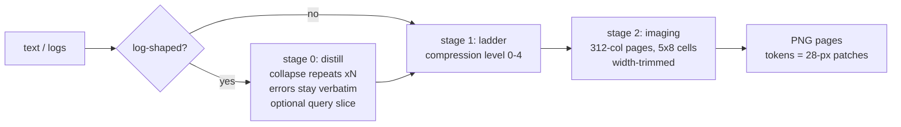

# tanuki-context

[](https://www.npmjs.com/package/tanuki-context)
Zero dependencies. 0.98 MB tarball. Runs anywhere Node >= 18 runs. MIT.

A model pays about 1 token per 4 characters to read text. A PNG page is
billed by pixel dimensions (Anthropic's 28x28-pixel patch grid), and a dense
page fits 3+ characters per token. [pxpipe](https://github.com/teamchong/pxpipe)
measured ~3.1 chars per image-token on real Claude Code traffic and built a
transparent proxy on that gap. tanuki-context is the same imaging engine with
a different contract: the model calls a tool when it wants the cut, sees
exactly what got imaged, and nothing is rewritten behind its back.

It takes bulky context (logs, docs, command output), optionally distills and
compresses it, then renders it as dense PNG pages. You get the numbers before
committing: `estimate` prices both routes and says which one wins.

## Measured

A 200 KB slice of this machine's system journal: 1,370 lines from tailscaled,
NetworkManager, the kernel, wpa_supplicant, and friends. Not a synthetic
fixture, and not cherry-picked to repeat itself (a plain `journalctl` tail is
so repetitive that distill flattens it to 5 lines, which looks fake even
though it isn't).

| how it enters context            | tokens |     saved |
| -------------------------------- | -----: | --------: |
| pasted as raw text               | 51,200 |         0 |
| rendered as pages (level 0)      | 10,752 |  **-79%** |
| distilled first, then rendered   |  5,320 |  **-90%** |
| distilled + codebook + tiny font |  2,352 |  **-95%** |

Reproduce on your own log; every row is one command:

```
npx tanuki-context estimate your.log 0
npx tanuki-context estimate your.log 0 --distill
npx tanuki-context estimate your.log 0 --distill --codebook --font tiny
```

Savings depend on the content. Repetitive logs crush well. Dense unique text
still gets the flat ~3-4x from imaging alone. Small inputs technically win
too, but by so little it is rarely worth the modality switch; see
[Limits](#limits-plainly).

## Quick start

```
npx tanuki-context
```

That is the MCP stdio server. Register it in any client:

```json
{ "mcpServers": { "tanuki-context": { "command": "npx", "args": ["-y", "tanuki-context"] } } }
```

Or poke at the CLI first. Real output, same 200 KB journal slice:

```
npx tanuki-context estimate journal.log 0
# { "imageTokens": 10752, "verdict": "PIPELINE cheaper",
#   "recommend": { "distill": true, "codebook": true, "imageTokens": 3920,
#                  "pages": 3, "tinyImageTokens": 2352 }, ... }
npx tanuki-context render journal.log 2 ./pages --codebook
# ./pages/page0.png ...
```

## Clients

**OMP (oh-my-pi)** - `~/.omp/agent/mcp.json`, or `.omp/mcp.json` in the project:

```json
{ "mcpServers": { "tanuki-context": { "command": "npx", "args": ["-y", "tanuki-context"] } } }
```

**jcode** - `~/.jcode/mcp.json`, or `.jcode/mcp.json` in the project. jcode
speaks stdio only; `"shared": true` reuses one server across sessions:

```json
{ "mcpServers": { "tanuki-context": { "command": "npx", "args": ["-y", "tanuki-context"], "shared": true } } }
```

**pi** - pi has no MCP layer, so this package doubles as a pi extension (the
`"pi"` manifest field in package.json):

```
pi install npm:tanuki-context
```

The five `tanuki_*` tools register natively; the extension spawns this
package's own stdio server per session.

**Claude Code**:

```
claude mcp add tanuki-context -- npx -y tanuki-context
```

**Rust instead of Node?** Same pipeline, same numbers, one 5.7 MB static
binary:

```
cargo install --git https://github.com/Osyna/tanuki-context --branch rust
```

Then `"command": "tanuki-context", "args": []` in any snippet above, or
`TANUKI_BIN=~/.cargo/bin/tanuki-context` for the pi extension. The two
engines are parity-tested against each other on every change; see
[Two engines](#two-engines) below.

## How it works



Three stages. The first two are optional.

**Stage 0, distill.** Built for logs. Repeated lines and repeated multi-line
blocks collapse to one exemplar plus an exact `xN` count. Near-duplicates
that differ only in timestamps, ids, or numbers fold into a template, also
counted. Error, warning, and fail lines are never touched. A `query` regex
returns only the slice you care about, with context. On the journal slice
above: 1,371 lines to 621, half the characters gone, all 318 error/warn
lines kept verbatim.

**Stage 1, the ladder.** Five text-compression levels, 0 (off) to 4 (gist
only). From level 2 up an exact-recall guard keeps code, identifiers, hashes,
paths, and indented lines verbatim, so loss is confined to prose. Honest
consequence: on technical files there is little prose to cut. This repo's
README loses 10% of its characters at level 2 and 14% at level 4; DESIGN.md
loses 6% at level 4. The ladder earns its keep on wordy prose (meeting notes,
chat transcripts, tickets); on code-heavy content it mostly just guards.
Level 1 (whitespace cleanup) is lossless and always safe.

**Stage 2, imaging.** The renderer packs text into 312-column pages of 5x8
antialiased cells (1568x728 px max; short pages get width-trimmed) and
encodes grayscale PNGs. This is where the big cut comes from, and it is flat:
raw text pays ~1 token per 4 chars, a full page carries ~28,000 chars for
1,456 image tokens. Full Unicode, 92,812 codepoints: CJK, Cyrillic, emoji,
astral planes. Unassigned codepoints render as readable `[U+HEX]` escapes.
Nothing disappears silently.

## Density knobs

Measured by `reference/methods-report.mjs` on three corpora; regenerate the
table with `bun reference/methods-report.mjs`. Percentages are against the
baseline renderer on the same content.

| knob                | what it does                                                                  | code | prose |  log |
| ------------------- | ----------------------------------------------------------------------------- | ---: | ----: | ---: |
| `pack` (default on) | single-cell tabs, `⇥N` indent runs, width-trimmed pages; byte-exact           |  -5% |    0% |   0% |
| `codebook`          | repeated tokens and path prefixes become 1-cell sigils plus a `·legend·` line |  -9% |    0% | -38% |
| `font: "tiny"`      | glyphs box-filtered into 4x6 cells; opt-in, see limits below                  | -36% |  -38% | -40% |
| all three stacked   |                                                                                | **-45%** | **-38%** | **-62%** |

The three corpora: `src/main.ts` (code), `DESIGN.md` (prose), a path-heavy
synthetic log. Knobs compose but do not add up linearly; `codebook` needs
repetition to bite, `pack` needs indentation.

## Tools (MCP, stdio)

| tool              | arguments                                                 | returns                                          |
| ----------------- | --------------------------------------------------------- | ------------------------------------------------ |
| `tanuki_render`   | `text, level?, distill?, query?, pack?, font?, codebook?` | PNG page blocks + savings breakdown              |
| `tanuki_estimate` | same as render                                            | page geometry, token math, and a `recommend` field: the cheapest safe knob set, priced |
| `tanuki_distill`  | `text, query?`                                            | stage 0 alone; output stays greppable text       |
| `tanuki_compress` | `text, level`                                             | stage 1 alone                                    |
| `tanuki_stats`    | none                                                      | savings summary from the session event log       |

`estimate` walks the safe knob ladder server-side (plain, codebook, distill,
both, at level 0) and returns the first rung that holds as `recommend`, with
the tiny-font price alongside. Probing those combos by hand costs about 590
tokens of tool chatter; the walk is one call.

`estimate` never touches pixel data. Call it on everything; render only when
the verdict says the pipeline wins.

## Limits, plainly

- **Rendering is exact; reading is a model skill.** Pages are pixel-faithful
  to pxpipe's production renderer, and pxpipe has receipts on how well models
  read them: near-perfect on arithmetic, gist, and state, but 13/15 on exact
  12-char hex strings for claude-fable-5, and misses are silent. Their
  numbers: [pxpipe benchmarks](https://github.com/teamchong/pxpipe#benchmark-results-and-receipts).
  Keep byte-exact-critical values (secrets, hashes you must retype) in text.
- **`font: "tiny"` trades legibility for tokens.** We measured 99.7%
  character read-back, and `M`/`H` is the confusable pair. Fine for logs and
  prose; skip it when the model must transcribe identifiers exactly.
- **Levels 2-4 reword prose.** The guard keeps code and identifiers verbatim,
  but prose comes back paraphrase-shaped. Level 4 is gist only. Do not use it
  for anything you may need to quote.
- **Tiny wins are not worth taking.** Width-trimming makes even small pages
  cheap on paper (12 short lines: 56 image tokens vs 115 as text), but a
  50-token win buys you an image the model has to read back instead of text
  it can quote. The proxy gate defaults to at least 25% and 300 tokens saved
  for exactly this reason; in tool mode, just leave small things alone.

## Implicit mode (proxy)

If you cannot touch the client, tanuki also runs as a local middlebox, the
way pxpipe deploys. We left the proxy model early on because rewriting the
system prompt into a user turn reads exactly like a prompt injection (an
agent once flagged it as an attack, and it was right to). The middlebox
came back with rules that remove that exact failure:

```
npx tanuki-context proxy                    # listens on 127.0.0.1:8484
export ANTHROPIC_BASE_URL=http://127.0.0.1:8484
```

Oversized text blocks in user messages and tool results are replaced in
place by a short visible marker plus PNG blocks, only when `estimate` says
imaging wins by a clear margin (default: at least 25% and 300 tokens). What
it never does:

- touch the system prompt or tool definitions
- move content between roles or positions
- image the latest message (you may need to quote it)
- rewrite blocks carrying `cache_control` (that would break their cache)
- rewrite anything when text is cheaper; those requests forward byte-for-byte

One thing it deliberately reuses: when the same oversized block appears
twice in one request (agents re-read files constantly), the second
byte-identical copy becomes a one-line pointer to the pages above instead
of the same pages again. Exact repeats only; a one-byte difference images
independently.

Responses stream through untouched. Savings land in `~/.pxpipe/events.jsonl`
(the same file `tanuki_stats` reads), with the baseline named: what Anthropic
billed, plus what the imaged blocks would have cost as text.

Knobs: `--port N` `--upstream URL` `--level 0-4` `--distill` `--codebook`
`--font tiny` `--min-chars N` `--ratio X` `--min-save N` `--max-pages N`.
Defaults are conservative: level 0, nothing lossy on.

## Claude Agent SDK

`tanuki-context/agent` wires the pipeline into agents built on the
[Claude Agent SDK](https://github.com/anthropics/claude-agent-sdk-typescript).

External (subprocess per session, zero extra dependencies):

```ts
import { query } from "@anthropic-ai/claude-agent-sdk";
import { withTanuki } from "tanuki-context/agent";

for await (const msg of query({ prompt: task, options: withTanuki({ model: "claude-..." }) })) {
  // agent now has tanuki_estimate / tanuki_render / tanuki_distill / ...
}
```

In-process (one server instance shared by every agent in the process):

```ts
import { tanukiSdkServer, tanukiAllowedTools, TANUKI_INSTRUCTIONS } from "tanuki-context/agent";

const tanuki = await tanukiSdkServer(); // needs the SDK + zod, which agent projects already have
const options = {
  mcpServers: { tanuki },
  allowedTools: tanukiAllowedTools(),
  systemPrompt: { type: "preset", preset: "claude_code", append: TANUKI_INSTRUCTIONS },
};
// hand the same `options` to every agent in the team
```

`withTanuki(options?)` merges into existing options without clobbering other
servers or tools. `TANUKI_INSTRUCTIONS` is a canned prompt block that teaches
agents the estimate-first workflow and the page decode grammar. The core
package stays zero-dependency: the SDK and zod are optional peers, touched
only inside `tanukiSdkServer()`.

Python SDK, plain dict config:

```python
from claude_agent_sdk import ClaudeAgentOptions

options = ClaudeAgentOptions(
    mcp_servers={"tanuki": {"command": "npx", "args": ["-y", "tanuki-context"]}},
    allowed_tools=[f"mcp__tanuki__tanuki_{t}" for t in
                   ["render", "estimate", "distill", "compress", "stats"]],
)
```

## CLI

```
npx tanuki-context                          # MCP stdio server (default)
npx tanuki-context proxy [--port 8484] [--upstream URL] [knobs]   # implicit middlebox
npx tanuki-context distill <file> [query]   # stats JSON to stdout
npx tanuki-context estimate <file> [level] [--distill] [--no-pack] [--font tiny] [--codebook]
npx tanuki-context render <file> [level] [outdir] [--no-pack] [--font tiny] [--codebook]
npx tanuki-context bench <file> <distill|pipeline> [level] [runs]   # in-process timing
```

## Footprint

Measured 2026-07-26 on a Ryzen 7 9700X, Linux. Spawn time is the median of 5
cold starts to the first MCP response; the reference server is the original
node MCP that wraps pxpipe's library (kept in `reference/node-mcp/`).

| metric                  | node    | bun     | rust    | node ref (pxpipe lib) |
| ----------------------- | ------- | ------- | ------- | --------------------- |
| spawn to first response | 35 ms   | 27 ms   | 0.4 ms  | 158 ms                |
| idle server RSS         | 87 MB   | 50 MB   | 3.8 MB  | 177 MB                |
| distill a 12 MB log     | 0.42 s  | 0.31 s  | 0.28 s  | -                     |
| install                 | 0.98 MB tarball, zero deps | same | 5.7 MB static binary | node_modules tree |

## Two engines

`main` is this TypeScript package. The [`rust` branch](../../tree/rust) is
the same pipeline in Rust: same patch-grid token model, same escapes, same
glyph atlas, same proxy rules. `reference/parity-ts.mjs` holds them to
byte-identical JSON and pixel-identical PNGs on every knob combination, plus
a full MCP session including error paths. When one engine changes, the
other follows, or the parity harness fails loudly. The npm packaging and
the Agent SDK / pi glue are TypeScript-only; everything the model sees is
identical.

The imaging engine is a remake of [pxpipe](https://github.com/teamchong/pxpipe):
page geometry and glyphs come from pxpipe's own generated atlas (Spleen 5x8
for ASCII and code, Unifont for the rest), so pages are pixel-faithful to
its production renderer, and the default path (`pack` off, normal font) is
byte-identical to it. Astral-plane coverage comes from GNU `unifont_upper`,
box-filtered to the same cells. pxpipe escapes astral codepoints as
`[U+HEX]`; tanuki renders them and reserves the escape for genuinely
unassigned codepoints.

## Repository layout

| path                   | role                                                                                         |
| ---------------------- | -------------------------------------------------------------------------------------------- |
| `src/main.ts`          | MCP stdio server (hand-rolled JSON-RPC) + CLI (entry: `src/cli.ts`)                          |
| `src/agent.ts`         | Claude Agent SDK glue: `withTanuki`, in-process `tanukiSdkServer`                            |
| `src/pi.ts`            | pi extension: five native tools over a spawned stdio server (`TANUKI_BIN` picks the engine) |
| `src/distill.ts`       | stage 0: 3-pass log distiller (runs, blocks, template near-dupes, query)                    |
| `src/ladder.ts`        | stage 1: levels 0-4 with the exact-recall guard                                              |
| `src/codebook.ts`      | repeated tokens and path prefixes to sigils plus `·legend·` (opt-in)                        |
| `src/render.ts`        | stage 2: reflow, pack, wrap, page split, AA blit, tiny 4x6 font                             |
| `src/proxy.ts`         | implicit mode: local Anthropic middlebox, in-place block imaging                             |
| `src/atlas.ts`         | glyph atlas (92,812 codepoints): metadata eager, pixels inflated lazily                     |
| `src/png.ts`           | minimal grayscale PNG encoder (`node:zlib`, filter-0 rows)                                   |
| `src/stats.ts`         | event log summary                                                                            |
| `assets/glyphs.*`      | generated glyph data (0.4 MB packed)                                                         |
| `tools/gen-glyphs.mjs` | regenerates `assets/` from pxpipe's atlas                                                    |
| `reference/`           | parity and benchmark harnesses (the retired node MCP lives here as an oracle)               |

Architecture notes and the reasoning behind each stage live in
[DESIGN.md](DESIGN.md).

## Build

Runs from source with Bun (`bun src/cli.ts`) or as the bundled,
Node-compatible files:

```
bun run build        # dist/cli.js + dist/agent.js + dist/pi.js
bun test             # 35 tests
bun run parity       # TS vs rust binary, byte/pixel-exact (needs TANUKI_BIN)
```

Regenerating glyphs after a pxpipe atlas rebuild (needs a pxpipe checkout
with `dist/` built; the generator fetches `unifont_upper` on first run):

```
PXPIPE_DIST=~/Projects/pxpipe/dist node tools/gen-glyphs.mjs
```
