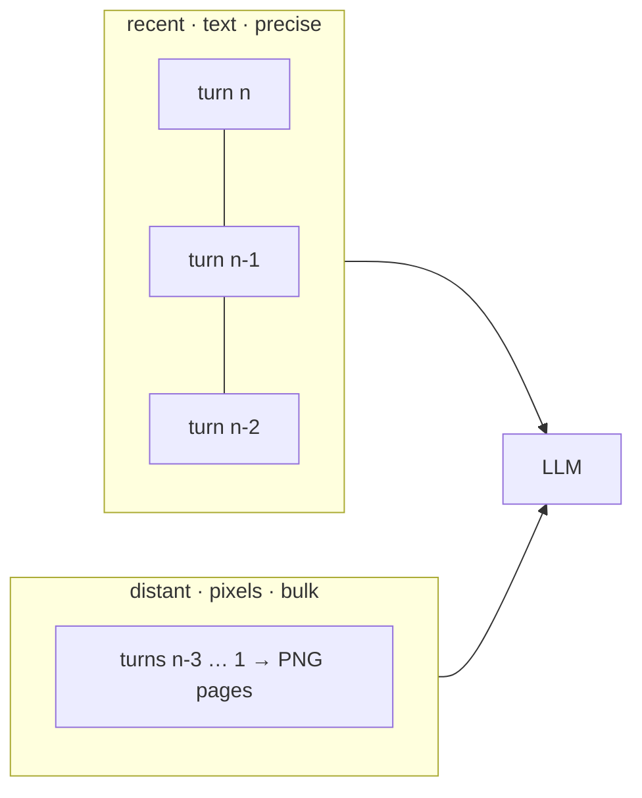

# Optical-compression research → tanuki roadmap (2026-07)

Four papers dropped in Oct 2025 that formalize exactly what tanuki-context
bets on: **text rendered as pixels is cheaper to feed an LLM than text as
tokens.** They are worth reading not because they threaten the tool but
because they draw the curve tanuki is a point on, and they hand us three
upgrades we can ship without breaking the two constraints that define the
project (zero-dependency, any-model, no training in the loop).

## Where the field is now

| paper | arXiv | one line | relevance |
|---|---|---|---|
| **DeepSeek-OCR** | [2510.18234](https://arxiv.org/abs/2510.18234) | trained encoder, **10×→97%**, **20×→60%** fidelity; vision-token budget as a dial (64/100/256/400/page) | the fidelity ceiling is real and *fundamental*, not a tanuki bug |
| **Glyph** | [2510.17800](https://arxiv.org/abs/2510.17800) | render text→image for a VLM; **LLM-driven genetic search** over `θ=(dpi,font,size,line_height,spacing,…)` at a fidelity floor; 3–4× | the auto-tuner tanuki's `recommend` isn't yet |
| **VIST** | [2502.00791](https://arxiv.org/abs/2502.00791) | slow-fast dual-path: **image distant context, keep nearby as text** | the routing axis tanuki's proxy is missing |
| **Text or Pixels? It Takes Half** | [2510.18279](https://arxiv.org/abs/2510.18279) | independent: text-as-image cuts ~½ tokens **without task-accuracy loss** on RULER + summarization | third-party proof of the core bet + the paired-run method |

Follow-ups already citing these (watch, don't build yet): VTC-R1
([2601.22069](https://arxiv.org/abs/2601.22069), RL learns *what* to render),
LensVLM ([2605.07019](https://arxiv.org/abs/2605.07019), learned selective
expansion = tanuki's `fetch`), Global Context Compression w/ interleaved
vision-text ([2601.10378](https://arxiv.org/abs/2601.10378)).

**Framing:** DeepSeek/Glyph/VIST all need a *fine-tuned VLM*. tanuki is the
**inference-time, any-model, zero-training** point on their curve — it can
never hit a trained DeepEncoder's 10–20×, but it needs no weights, no
provider cooperation, and runs against Claude/GPT/Gemini today. Every idea
below stays on that side of the line. The trained-encoder path is explicitly
**out** (breaks zero-dep + any-model).

---

## Upgrade 1 — Recency-tiered imaging (from VIST)   ★ top pick

**Gap.** The proxy decides imaging per **block size** (`≥25% && ≥300 tok`).
VIST shows the load-bearing axis is **distance/salience**: recent turns get
reasoned over precisely (keep as text), distant turns are low-salience bulk
(image them). tanuki already has a *1-turn* version of this — rule 3, "the
latest message is never imaged" — but it's a stub, not a dial.

**Change.** Add a `recencyWindow` to the proxy gate: the last *K* turns (or
*N* tokens) are never imaged regardless of size; everything older that clears
the existing margin is imaged as today. `src/proxy.ts` `transformRequestBody`
already walks messages in order and already has the size gate and the
`ProxySession` ledger — this is one position check added to the existing
per-block loop, and it stays fully deterministic (position is not model
state). Parity-safe: `recencyWindow=0` reproduces today's behavior byte-for-
byte, so it goes off the parity path exactly like `pack`/`codebook` did.

**Why disruptive.** It changes *what* tanuki images from "big blocks" to "old
context," which is how agent bills actually accrue (200 turns dragging the
same history — the exact complaint from the rakuen review). It directly
answers "does the agent still finish the job": the turns it's reasoning over
right now are never pixels.

## Upgrade 2 — Fidelity-aware rendering search (from Glyph)

**Gap.** `recommend` walks a fixed combo set (`pack`/`codebook`/`tiny`) and
ranks on **token count only**. Glyph optimizes a rich config vector against
an **accuracy** objective via genetic search. tanuki already owns both halves
Glyph had to build: the config space (font cell, pack, codebook, page
geometry) **and the fitness function** — `reference/needle-report.mjs` scores
exact recall at any config. They've never been wired together.

**Change.** An offline `tanuki calibrate` that runs the needle harness across
the render-config grid for a target model and emits a profile: *"for this
reader, tiny-4×6 holds 99.7% char / 20% needle-recall; 5×8 holds 100% /
50%."* `recommend` then reads the profile instead of guessing a fixed
font. This is Glyph's method **minus the model training** — deterministic
renderer + real read-back oracle. Not on the hot path (offline, ships a JSON
profile), so zero-dep and parity are untouched.

**Why disruptive.** Turns the fidelity/density tradeoff from a hand-set
opt-in gate into a *measured, per-model* decision — the thing DeepSeek's
budget ladder and Glyph's search both are, done without weights.

## Upgrade 3 — Per-model density profiles + smooth dial (DeepSeek + "It Takes Half")

**Gap.** tanuki's density is a 2-point guess (5×8, opt-in 4×6) and its cost
model is *analytic* (patch math). DeepSeek treats vision-token budget as a
smooth dial with a *measured* fidelity at each stop; "It Takes Half" shows
efficiency is empirical and ~2× on decoder LLMs (vs tanuki's analytic 3–4×
chars/token — the delta is exactly what *distill* adds on top of raw
imaging). §6's wanted "high-res 2576-px tier" is the same idea pointed the
other way.

**Change.** Ship measured per-model profiles (efficiency + needle curve) as
data, produced by Upgrade 2's `calibrate`. `recommend` picks density from the
reader's actual curve; the high-res tier and tiny font become two stops on
one dial, each with a number attached, not a coin flip. Pairs with the
`TANUKI_RATES` override pattern already in `src/cost.ts` — calibration data,
not code.

## Upgrade 4 — Confusable-aware atlas + adaptive per-token density (DeepSeek ceiling + our own needle misses)

**Gap.** DeepSeek's 20×→60% confirms the fidelity ceiling is fundamental.
tanuki's misses are *single confusable characters* in high-entropy tokens
(`a279`→`a379`, `1.15.6`→`1.15.8`, `M`→`H`). The `verbatim` sidecar dodges
this by duplicating needles as text; two cheaper attacks on the root cause:

- **(a) Confusable-maximizing atlas.** pxpipe's K→H repaint (Hamming 1→8,
  42→1 confusions) was one pair done by hand. Generalize: compute the atlas
  glyph-confusion matrix, repaint the worst pairs for max Hamming distance,
  prioritizing **digits/hex** (the needle massacre). Deterministic, one-time,
  parity-scoped (it changes the shared atlas, so both engines regen from it).
- **(b) Mixture-of-resolution rendering.** Instead of uniform cells, render
  the high-entropy tokens the sidecar scan *already finds* (hex/ids/versions)
  in a **larger** cell while prose stays tiny — the mixture-of-resolution
  idea from the VLM literature (cf. *Feast Your Eyes*, 2403.03003). Cheaper
  than full sidecar duplication for borderline files, and it keeps the needle
  *in place* rather than in a trailer.

## Upgrade 5 — Adopt the field's eval as external validation (cheap, honest)

DeepSeek names **needle-in-a-haystack** as *future* work; tanuki already
ships it (`needle-report.mjs`) plus a task-success paired harness
(`paired-report.mjs`) — that's genuinely *ahead of the paper on evaluation*,
worth stating in README/DESIGN. "It Takes Half" (~½ tokens, no RULER accuracy
loss) is a citable third-party answer to the reviewer's open question ("does
the agent still finish the job"); our paired harness is the local rerun of
that exact experiment. No code — a positioning + citation pass.

---

## Ranked

| # | upgrade | disruptive | effort | zero-dep / parity |
|---|---|---|---|---|
| 1 | Recency-tiered imaging (VIST) | high | low (1 gate rule) | safe (`window=0` = today) |
| 2 | Fidelity-aware render search (Glyph) | high | med (offline tool) | safe (offline, JSON out) |
| 3 | Per-model density profiles (DeepSeek) | med-high | med (needs #2) | safe (data, like RATES) |
| 4 | Confusable atlas + mixed-res | med-high | med-high (atlas work) | atlas regen, parity-scoped |
| 5 | Eval-as-validation + citations | low | trivial | docs only |

**Recommended next step:** build #1. It's the smallest diff, the biggest
behavioral change, lands on the exact axis the rakuen review said the bill
lives on (retire/cap the dragged-along history), and it's the one VIST result
that transfers to a deterministic middlebox with zero training. #2 unlocks #3
and should follow.

**Deliberately not doing:** trained encoder (DeepSeek/Glyph) — breaks
zero-dep + any-model; RL render policy (VTC-R1) — model in the loop, the
LLMLingua line we already hold.

---

## Shipped from the second research pass (2026-07-27)

A follow-up literature report (DeepSeek-OCR, Glyph, PIXEL, OCR-B, Crockford/
Damm, Drain, RULER, UTS-39) re-ranked the same curve. What landed and why:

- **Analytic fidelity band in `estimate`** (partial Upgrade 3). The DeepSeek-OCR
  density cliff ([2510.18234](https://arxiv.org/abs/2510.18234)) is now a
  first-class `fidelity` field: the text/vision token ratio mapped to a read-back
  band, with the 4×6 tiny font floored to `low` (an orthogonal legibility axis
  the ratio misses, confirmed by our own tier sweep). Both engines, parity-locked
  (`src/fidelity.ts` / `src/fidelity.rs`). The *calibrated per-model* version
  (Upgrade 2 `calibrate`) is still the next step — this ships the curve as
  evidence-based defaults without a measured profile.
- **Confusable-free sigil guard** (measurement half of Upgrade 4a). Rather than
  repaint the atlas blind, `test/fidelity.test.ts` computes the glyph-confusion
  distance on the real 5×8 cell and pins every codebook sigil below the `0`/`O`
  confusability baseline. Measured: the current set already clears it (~1.5×), so
  the recommended *swap* was unwarranted churn — the guard prevents regression
  instead. The full atlas repaint stays deferred (broad parity cost, no measured
  miss at the production font).

Deferred with rationale (researched, not built):

- **Damm/Verhoeff check character on sidecar values** (report rec #1). Marginal
  here: the `verbatim` sidecar already ships exact strings as *text*, read
  losslessly — no pixel round-trip left to protect, and no deterministic verifier
  sees the model's output. It would add a character to every needle for a check
  nothing in the MCP flow can run.
- **ms-timestamp / base64 sidecar kinds** (Area 3). Correctly *excluded*:
  timestamps recur on every log line (they would fill the 32-cap with non-grep
  targets), and a generic base64 pattern false-positives across hashes/words and
  guts compression. The measured `ms`/`base64` needle misses are the price of
  that exclusion, not a bug.
- **Paired RULER/LongBench-v2 reasoning A/B** (rec #3), **Drain/LogHub distill
  benchmark** (rec #4), **Glyph-style render search + patch-grid alignment** (recs
  #5/#7, Upgrades 2–3), **MinHash-LSH dedup** (rec #8), **LLMLingua prose mode**
  (rec #9): real, but each needs a metered model loop or a larger build; tracked
  above.
